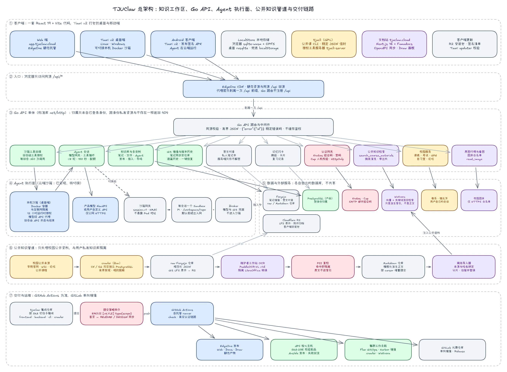

<!-- AUTO-GENERATED from docs/content/docs/index.md. DO NOT EDIT DIRECTLY. -->
<!-- Run `task docs:sync` or `task docs:design` to regenerate. -->

> **提示**：本文档与官方文档站首页保持同步。如需浏览完整开发手册、API 规范与技术长文专栏，请访问：[https://tjuclaw.cloud/](https://tjuclaw.cloud/)。

# TJUClaw：从校园出发的通用智能体平台

TJUClaw 是一个从天津大学校园场景出发、正在走向通用的智能体（AI Agent）平台。它把知识工作区、隔离执行沙箱和确定性工具接口组合在一起，让 Agent 在受控环境里完成多步骤任务并交付可校验的结果。

校园是我们的起点，不再是边界：课程资料检索、空闲教室查询这些校园能力仍然可用，但我们正在把它们从 Agent 本体中解构出来，变成可以按需装卸的一组工具；Agent 本体则朝着原生 CLI Coding Agent、插件与 MCP 市场、远程控制这些更通用的方向演进。具体进度见下方的[近期计划](#近期计划)。

---

## 快速开始

可以通过以下方式直接体验平台功能：

- **Web 端**：访问 [https://app.tjuclaw.cloud/](https://app.tjuclaw.cloud/)，登录后使用知识库、笔记、智能体和市场；
- **原生客户端**：可在首页获取对应平台的安装包：
  - **Windows**: 64 位安装程序（`.exe`）
  - **Linux**: Debian / Ubuntu 软件包（`.deb`）
  - **Android**: 安装包（`.apk`）
- **服务状态**：[https://status.tjuclaw.cloud/](https://status.tjuclaw.cloud/) 实时显示各组件的可用性与响应延迟；
- **更新日志**：[https://changelog.tjuclaw.cloud/](https://changelog.tjuclaw.cloud/) 记录每一次发布改了什么。

> 第一次使用请先阅读[产品使用指南](/docs/guide)；本地源码调试与完整开发环境搭建步骤见[开发环境与本地验证](/docs/quickstart)。

---

## 0.1.5 目标：让 TJUClaw 开发它自己

0.1.5 的主题是**强大的远程开发能力**。最终验收是一次自举：在手机或网页上，对连接好的开发机上的 TJUClaw 仓库提出一个需求，Agent 在那台电脑上改代码、跑测试、提交分支并发起 PR，整个过程在网页上实时可见、可以逐步审批，这个改动最终合并上线。

我们把它拆成五个里程碑：

1. **连接电脑**：TJUClaw CLI 正式发布 Linux、macOS 与 Windows 版本，桌面客户端内置；一条 `tjuclaw connect` 命令把电脑连到账号，“工作”侧栏的主机列表随即出现这台电脑；在电脑上的项目里开始的对话，Agent 就在那个项目文件夹里工作。
2. **远程开发体验**：电脑上的每一步实时显示在网页和手机上；Agent 需要执行命令或修改文件时，在网页和手机上审批；会话里可以查看改动差异、命令输出与测试结果，可以中断、续接，并在 Pi、Codex、Claude Code 之间切换引擎。
3. **Coding Agent CLI**：`tjuclaw` 在终端里就是一个完整的编程 Agent，支持交互式界面、读写文件、运行命令、审批与会话续接；适配 Codex 与 Claude Code，可直接使用自己的账号；终端里的会话同步到账号，在网页上也能查看和继续。
4. **校园与 MCP 完善**：MCP 支持需要 OAuth 登录的服务、按工具开关与调用前确认，扩充精选目录并逐个实测；校园小工具（课表、GPA、考试、自习室、论坛、入校码）逐项回归，完成校园任务与执行任务两条验收流程。
5. **自举**：用 TJUClaw 在 TJUClaw 自己的仓库里完成一次真实改动，从需求到 PR 再到上线，全程留存记录。

主线是 1 → 2 → 5，3 与 4 并行推进。

## 近期计划

为了优化网络性能、降低长期算力成本，并为未来更惊艳的功能做准备，我们正在迁移和重构一批基础设施与产品能力：

| 事项 | 状态 |
| :--- | :--- |
| 迁移重构镜像仓库 | 已完成 |
| 迁移重构 CI/CD Runner | 已完成 |
| 迁移重构集群沙箱服务 | 还在挑选服务器 |
| 适配最新版本的 Pi Agent 1.0、Codex 与 Claude Code | Pi Agent 1.0 已完成；Codex 与 Claude Code 进行中 |
| 实现原生的 CLI Coding Agent 版本 | 进行中，0.1.5 的里程碑之一 |
| 规范化版本更新与发布节奏 | 已完成，见[更新日志](https://changelog.tjuclaw.cloud/) |
| 将校园服务与 Agent 本体解构，迈向更通用的方向 | 进行中 |
| 实现完整的插件和 MCP 市场 | 首版已上线：MCP 服务（精选目录与自定义地址）和 6 个技能插件；第三方插件进行中 |
| 实现完整的远程控制功能 | 进行中，见上方 0.1.5 目标 |
| 测试并解决功能 bug | 进行中 |
| 创建详细的状态页面，做更细致的性能分析 | 已完成，见[服务状态](https://status.tjuclaw.cloud/) |

> 第一个版本 **0.1** 已于 2026 年 10 月 3 日发布，详见[更新日志](https://changelog.tjuclaw.cloud/)。表中仍在进行的事项会在后续版本陆续完成，期间服务可用性可能出现亿点点波动，不过长期来看都是值得的。

---

## 模块划分与仓库矩阵

> **主要仓库说明**：TJUClaw 由开源、闭源和私有基础设施仓库共同组成。全平台自动化构建、跨端编译矩阵（Linux / Windows / Android）以及多项集成测试由持续集成流水线完成。公开仓库可直接检出，闭源仓库仅供受控集成和部署使用。

| 仓库 / 模块 | 访问级别 | 许可证 | 技术栈 | 职责与说明 | 本地路径 |
| :--- | :--- | :--- | :--- | :--- | :--- |
| **[tjuclaw](https://github.com/yunzaixi-dev/tjuclaw)** | 开源 | Apache-2.0（根仓材料） | TypeScript · Next.js 16.3 · Fumadocs | **总集成仓与文档** 包含 Taskfile 统一指令、文档站与 Ansible 部署配置 | 根目录 (`.`) |
| **[tjuclaw-client](https://github.com/yunzaixi-dev/tjuclaw-client)** | 开源 | GPL-3.0-only | TypeScript · React 19 · Tauri v2 | **多端客户端** 构建 Web 端及 Windows、Linux、Android 客户端 | `frontend/` |
| **[tjuclaw-server](https://github.com/yunzaixi-dev/tjuclaw-server)** | 闭源 | 未授权（保留所有权利） | Go 1.27 | **业务 API 与会话网关** 处理业务逻辑、任务状态管理与认证鉴权 | `backend/` |
| **[tjuclaw-sandbox](https://github.com/yunzaixi-dev/tjuclaw-sandbox)** | 闭源 | 未授权（保留所有权利） | Kubernetes · OCI · Linux | **自建 Agent 执行沙箱** 管理临时 Run 隔离、工作区契约、资源与网络策略；生产 GitOps 由基础设施仓库管理 | `sandbox/` |
| **[tjucli](https://github.com/yunzaixi-dev/tjucli)** | 开源 | GPL-3.0-only | Go 1.27 | **命令行工具与 Tool Server** 将校园公开服务封装为标准输入输出的 CLI 工具 | `cli/` |
| **[tjuclaw-crawler](https://github.com/yunzaixi-dev/tjuclaw-crawler)** | 闭源 | 未授权（保留所有权利） | TypeScript · Bun · PostgreSQL | **公开情报采集** 采集校园公开信息，生成增量事件流与结构化数据 | `crawler/` |
---

## 许可证与源码边界

这是一个按目录和 Git 子模块分别授权的聚合仓，不存在覆盖所有内容的单一许可证：

- 根仓自己的文档、Taskfile、CI、运维与组合工具使用 **Apache-2.0**；完整文本见仓库根目录的 `LICENSE`，适用范围见 `NOTICE`。
- TJUClaw 自有文档、架构图和宣传材料另采用 **CC BY 4.0**；完整文本见 `LICENSE-DOCS`。转载、修改、材料报送和公开展示时请保留 TJUClaw 署名及 [主仓链接](https://github.com/yunzaixi-dev/tjuclaw)。
- 参加同一大赛的组委会可在赛事相关宣传、材料报送和公开展示中直接复制、修改、转载和使用这些 TJUClaw 自有材料，无需额外申请；第三方截图、Logo、商标、字体、依赖和私有组件源码不在此授权内。
- `frontend/`（`tjuclaw-client`）和 `cli/`（`tjucli`）使用 **GPL-3.0-only**；对应子仓库中的 `LICENSE` 是其源码和再发布条件的准据。
- `backend/`（`tjuclaw-server`）和 `crawler/`（`tjuclaw-crawler`）是闭源组件，**未授予公开使用、复制、修改或再分发许可**；其源码仅用于受控集成和部署。
- `sandbox/`（`tjuclaw-sandbox`）是闭源执行基础设施组件，**未授予公开使用、复制、修改或再分发许可**；生产集群凭据、镜像签名材料和 GitOps 环境配置不进入该仓库。
- 根仓的 Apache-2.0 和 CC BY 4.0 不会授权闭源子模块，也不会替代 GPL 子模块自己的许可证；第三方依赖继续遵循各自许可证。
- 各仓库的 GitHub 地址见上方仓库矩阵；子模块是独立作品，不因被聚合到本仓而改变其许可证。

许可证只授予相应目录或子仓库中的版权作品，不授予 TJUClaw、校名、校徽、服务名称或第三方商标的使用权。

## 核心架构设计

下图是 TJUClaw 的总架构：七个分区自上而下依次是客户端、同源入口、Go API 单体、Agent 执行面、数据与外部服务、公开知识管道和交付链路。实线是已上线的调用关系，虚线是已实现但尚未切换或仍在接入的路径。

TJUClaw 把产品拆成几条互相配合、但不互相越权的路径：

- **知识工作区**：用户在同一棵条目树里管理 Markdown 笔记、智能体、工作环境说明和文件入口。
- **业务 API**：Go 服务负责身份验证、资源归属、会话、发布关系、模型网关和 Run 编排。
- **代码工作区**：Forgejo 保存代码历史；每次执行按固定 commit 建立沙箱工作树，并通过 checkpoint commit 保持可恢复。
- **附件与产物**：PostgreSQL 保存元数据，R2 承载二进制对象；私有附件通过应用层加密保持密文传输。
- **派生检索**：WeKnora 或沙箱本地索引只保存为检索服务的派生数据，不能替代正文和权限。
- **隔离执行**：Agent 在受控 Kubernetes 沙箱中运行，凭据使用短期、限范围的授权，不把长期密钥交给模型或用户代码。

详细的数据流、加密仓库、R2 分块附件、模糊搜索和沙箱边界见[系统架构：知识工作区、代码工作区与受控执行](/docs/architecture)。

---

## 模型组合选择

TJUClaw 不让一个模型承担从文档解析到 Agent 执行的全部工作，而是根据任务边界选择不同模型：

| 任务 | 当前选择 | 作用 |
| :--- | :--- | :--- |
| Agent 主模型 | DeepSeek-V4.1-Flash (`deepseek-v4-flash`) | 由 Pi 驱动规划、工具调用、观察反馈与最终回答 |
| 文档整理 | Qwen3.8-Flash (`qwen3.8-flash`) | 修复损坏结构，整理派生 Markdown 与文档元数据 |
| 向量嵌入 | Qwen3.7 通用文本向量 (`qwen3.7-text-embedding`) | 生成 1024 维 WeKnora 检索向量 |
| 候选重排 | Qwen3.7 通用文本重排序 (`qwen3.7-text-rerank`) | 对向量召回结果进行二阶段排序 |
| OCR 与版面解析 | PaddleOCR | 处理扫描 PDF 和图片中的文字与版面 |

主模型关注 Agent 的行动与交付，文档模型关注内容归一化，Embedding 与 Rerank 关注知识检索；职责分离让每个环节都能独立评测、替换和回滚。详细选择依据见：[数据管道与向量化](./blog/data-pipeline.md) 和 [Pi 与主模型选择](./blog/why-pi-as-agent-harness.md)。

---

## 技术博客 (Engineering Blog)

各子系统在设计、实现与踩坑上的记录：

1. [《数据的复杂采集、脱敏、归一与向量化》](./blog/data-pipeline.md)：以线上学院站与课程网盘的真实体量为上游，说明从公开 HTML/PDF 到 Canonical Markdown、WeKnora、文档溯源与 Agent 检索的目标管道。
2. [《为什么我们选择 Pi 作为 Agent 底座》](./blog/why-pi-as-agent-harness.md)：对比 Chatbox 与 Harness 两种形态，说明为何不采用 LangChain/LangGraph、Pi 在产品执行链里的位置，以及它当前的状态。
3. [《祖传前后端架构，但是 2026》](./blog/backend-architecture.md)：一次浏览器请求要穿过几个域名？拆开 TJUClaw 的真实拓扑——Go 标准库、两级边缘接力、只剥一次的前缀，与一张不认客户端的会话门禁。
4. [《智能体的代码执行、文件系统，与隔离沙箱》](./blog/code-execution-and-sandbox.md)：代码执行的生命周期、自建 Kubernetes 沙箱的工作区文件系统与隔离边界，以及 `tjucli-server` 的单次授权代理。
5. [《为什么我们把 Agent 的能力做成 CLI：tjucli 的设计》](./blog/why-cli-as-agent-tool.md)：对比 MCP、SDK 与独立二进制三条路，说明确定性 JSON 封套、双模运行与原子落盘的取舍。
6. [《跨平台智能体客户端的实现：Web、桌面端与移动端》](./blog/cross-platform-clients.md)：单一代码仓库驱动 Web、Linux、Windows 与 Android；Tauri v2 宿主、OKLCH 语义令牌与同源会话流。
7. [《从代码仓库到持续交付：TJUClaw 的仓库划分与 CI/CD》](./blog/repository-and-cicd.md)：Git 子模块拓扑、两分支模型、跨平台构建矩阵与两步发版，以及三个 EdgeOne Makers 项目的静态部署。

---

**Star 分析博客 · [一颗星值多少钱：把 660 条点星记录按毫秒排了一遍](https://tjuclaw.cloud/docs/blog/star-ledger)**

> 我们拉取了大赛平台 49 个可见项目的全部点星原始数据：498 个点星账号里 **74% 只点过一颗星**；一半的星挤在截止前三天；
> 按账号注册顺序排列，能看到 **37 个连续注册的账号给同一个项目点星、此后再没点过别的**。星更多衡量的是动员能力，而不是作品好不好用。
> 文章不点名、不列学号，吐槽的是机制。
