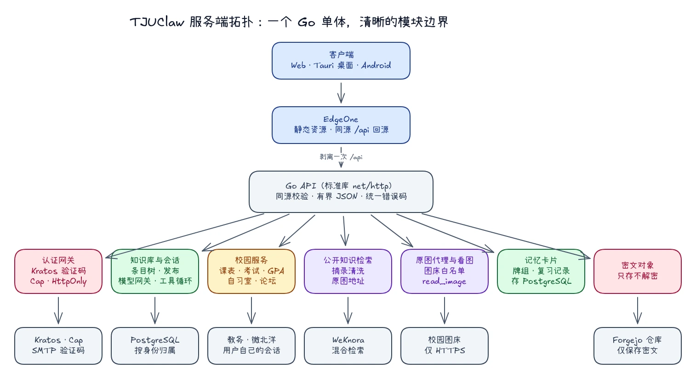

# 祖传前后端架构，但是 2026

TJUClaw 的后端没有服务网格、没有 GraphQL，也没有消息总线。它是一个 Go 进程，用标准库 `net/http` 注册路由，前面放一层 CDN。

这不是为了怀旧。一个校园 Agent 平台的后端，真正要做好的事情其实很少：确认请求来自谁，保证每个人只碰得到自己的数据，把模型和校园服务的调用约束在明确的边界里，并且在出错时给出稳定、可以处理的错误。把这几件事做扎实，比引入一套新架构更要紧。

所以我们选了一套「祖传」的组合：**Go 标准库单体、REST 接口、可插拔存储、HttpOnly Cookie 同源认证**。下面记录的是这套组合在这段时间里长出来的模块边界。

---

## 1. 总体拓扑：一个进程，清晰的模块边界



*图：客户端只访问同源 `/api/*`；边缘层剥离一次前缀后回源到单个 Go 进程，每个模块只连接自己需要的下游。*

后端是一个单二进制 Go 守护进程，只监听本机回环地址，由边缘层回源访问。进程内按职责划分模块：

| 模块 | 路由前缀 | 职责 |
| --- | --- | --- |
| 认证网关 | `/auth/*` | 邮箱验证码与密码登录，把身份会话封装进 HttpOnly Cookie |
| 知识库与会话 | `/libraries` `/entries` `/sessions` `/market` `/account/model` | 条目树、笔记正文、文件、发布与接入、Agent 会话、模型配置 |
| 校园服务 | `/campus/*` | 课表、考试、GPA、学期、自习室、论坛，使用用户自己的校园会话 |
| 公开知识检索 | （Agent 工具） | 调用 WeKnora 混合检索，清洗摘录并取出原图地址 |
| 原图代理与看图 | `/media/image`、`read_image` | 只代理白名单图床的 HTTPS 图片，并让多模态模型读图 |
| 记忆卡片 | `/decks` `/cards` `/reviews` | 牌组、模板、复习记录与导出 |
| 密文对象 | `/vault/*` | 保存客户端加密后的对象，服务端不解密、不索引 |

它的定位非常明确：**业务规则的终审者、会话的守门人、下游服务的受控出口；而不是模型推理机，也不是任意脚本的执行场。**

---

## 2. 拒绝框架膨胀：拥抱标准库 `net/http`

TJUClaw **没有引入任何第三方 HTTP 路由框架**。Go 1.22 起，标准库 `ServeMux` 原生支持方法匹配与路径参数：

```go
mux.HandleFunc("GET /libraries/{id}/entries", h.listEntries)
mux.HandleFunc("POST /sessions/{id}/messages", h.postMessage)
mux.HandleFunc("GET /campus/studyroom/buildings/{buildingID}/rooms", h.rooms)
```

启动入口只做显式组装：先创建认证网关，再按环境变量决定启用哪些模块和存储驱动，最后把各模块注册到同一个 `mux` 上。没有全局单例，也没有隐式的依赖注入容器。

坚持标准库的理由很朴素：

1. **表达力已经足够**：第三方框架曾经的路由优势已经不复存在；
2. **更小的供应链面**：依赖越少，需要追踪的 CVE 与版本锁死风险越少；
3. **确定的生命周期**：`signal.NotifyContext` 监听 `SIGINT`/`SIGTERM`，`server.Shutdown` 留出 10 秒排空连接。

路由不带 `/api` 前缀。浏览器永远请求同源的 `/api/*`，由开发代理或边缘层**只剥离一次**前缀后回源。这条约定让本地开发、预发和生产使用完全相同的客户端代码。

---

## 3. 会话与安全基线：HttpOnly 强同源防线

很多「前后端分离」系统习惯把 JWT 交给前端 JavaScript 保存，再手动附加 `Authorization` 头。这种模式在客户端出现 XSS 时几乎没有防御能力。

TJUClaw 的认证链路是：

```text
邮箱 → Cap 人机校验 → Kratos 发送验证码 → 用户回填验证码
     → Go API 取得 Kratos 会话令牌
     → 用 AUTH_COOKIE_KEY 封装为 HttpOnly、SameSite=Lax、Secure 的 Cookie
```

之后每个受保护请求都经过同一个守门流程：

- **强同源校验**：状态修改请求必须来自受信任的 Origin；
- **会话实时核验**：每次都向身份服务确认会话仍然有效，不在 API 进程里缓存认证结果；
- **所有权来自身份**：业务数据的归属一律取自已验证的身份 ID，从不信任请求体或路径里的 `user_id`；
- **统一的错误外形**：所有错误都是 `{"error":{"id":"machine_code"}}`，并附带 `Cache-Control: no-store` 与 `X-Content-Type-Options: nosniff`；
- **404 伪装**：访问他人的私有记录，与访问不存在的记录得到完全相同的 404，攻击者无法通过状态码差异遍历 ID。

密码是 Kratos 上的附加登录方式，不是第二套身份库；未验证邮箱的密码会话视为无效。

---

## 4. 存储抽象：同一个接口，两套驱动

每个有状态的模块都先定义一个 Store 接口，再提供两种实现：

| 驱动 | 运行机制 | 适用场景 |
| --- | --- | --- |
| 文件驱动 | 按身份分目录落盘；先写临时文件、`fsync`，再原子重命名 | 本地开发、CI，以及单机部署 |
| PostgreSQL 驱动 | `pgx` 连接池，复合主键约束所有权 | 需要多实例或更高并发时 |

启动时只读一次 `DATABASE_URL`：为空就使用文件驱动并在日志中写明，否则切换为 PostgreSQL。知识库、会话、任务、运行记录、记忆卡片都遵循这一模式，所以 `task dev` 不需要 Docker 也能完整跑起来，单元测试可以在毫秒内完成。

---

## 5. 模型转发：只做受控的出口

用户可以在设置里选择产品模型，也可以填写自己的 OpenAI 兼容 API。模型名称调整待发布：普通账号可选 `deepseek-flash` 与 `gemini-3.8-flash-tiered`，界面直接显示接口名称，不再使用别名；经过验证的站主账号可选更多模型。自定义上游由 Go API 受控转发：

- 自定义上游只允许公网 HTTPS，拒绝回环、私有网段、链路本地地址和云元数据主机名，重定向到这些地址同样被拒绝；
- Key 与完整 URL 只保存在服务端，不回显给浏览器，不写日志，不进入笔记或模型上下文；
- 转发器只实现 Chat Completions，**它不是任意 HTTP 代理**。

---

## 6. Agent 工具循环：后端里最「新」的部分

会话消息接口里运行着一个有界的工具循环：

```text
用户消息 → 模型（附带工具定义）
        → 工具调用 → 执行 → 结果截断至 16 KiB → 回到模型
        → …… 最多 8 轮，整体 150 秒上限
        → 最终回答（记录本轮用到的工具名）
```

工具以 `Provider` 接口注册，只有配置齐全的模块才会出现在工具列表里：

- **校园工具**：`campus_semester`、`campus_timetable`、`campus_exams`、`campus_study_rooms`、`campus_forum_posts`。它们不是另写一套逻辑，而是把当前用户的请求克隆成干净的 GET，在进程内回放到校园路由上，因此权限、会话与错误处理和用户亲自点开「小工具」完全一致；
- **`search_course_materials`**：检索公开知识库，返回带出处、原图地址的摘录；
- **`read_image`**：只读取白名单图床上的 HTTPS 图片，交给原生多模态的产品模型描述或读出文字。

系统提示词会注入北京时间与当前可用的工具清单，让模型知道「今天是第几周」，也知道「这次能做什么、不能做什么」。

---

## 7. 确定性有界防御：拒绝不合理请求

后端的稳定性往往取决于它能多坚决地**拒绝不合理请求**：

1. **请求体上限**：普通 JSON 请求 16 KiB，笔记正文 256 KiB，文件上传另有独立上限，全部通过 `http.MaxBytesReader` 在读取阶段截断；
2. **连接超时**：`ReadHeaderTimeout 5s`、`ReadTimeout 15s`、`WriteTimeout 90s`（启用长会话时放宽）、`IdleTimeout 60s`；
3. **下游有界**：模型响应、图片、检索结果都有字节上限；原图代理只接受 JPEG/PNG/GIF/WebP，最大 10 MB，最多跟随 3 次且只在白名单内的重定向。

没有任何一个协程会被长耗时的悬挂请求无限期占用。

---

## 8. 总结

模型的行为不确定，所以它周围的系统要尽量确定。TJUClaw 的后端把这件事落在几条很具体的规则上：路由只用标准库，会话令牌只在 HttpOnly Cookie 里，资源归属只看登录身份，模型转发只允许受控的出口，工具循环每一轮都有上限。

这些选择都谈不上新，但每一条都容易验证，出了问题也容易定位。对一个还在快速迭代的项目来说，这比架构图好看更重要。
