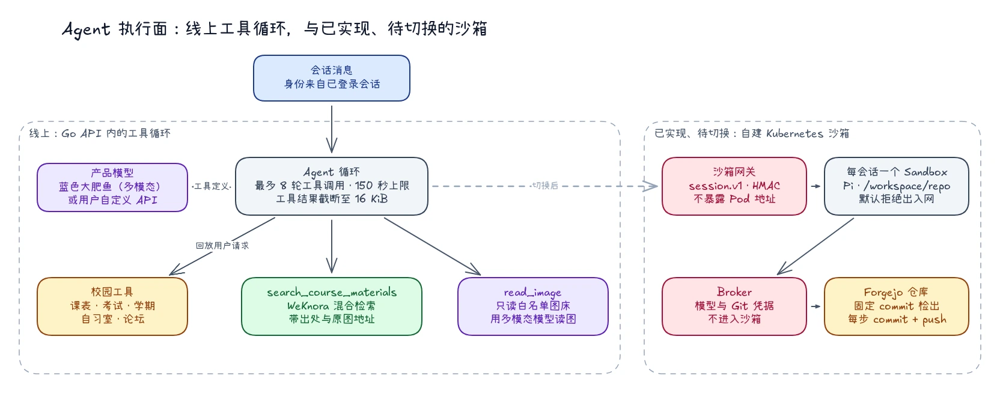

# 《智能体的代码执行、文件系统，与隔离沙箱》

在前面的文章里，我们阐述了 TJUClaw 的核心理念：**Agent Harness 的本质不是构建一个更复杂的问答对话框，而是为模型提供一个真实的执行环境。**

但「真实的执行环境」一旦落地，就立刻撞上三个问题：

- 任意代码执行如何避免破坏宿主机或窃取平台凭证？
- 智能体产生的文件如何持久化？沙箱销毁后如何保证数据不丢失、不交叉污染？
- 校园数据与工具权限如何在隔离网络中受控流通？

TJUClaw 的回答分成两步走：**先上线一个没有 Shell、但每一轮都有上限的工具循环；再把 Shell 与文件系统放进一个独立的自建 Kubernetes 沙箱。** 本文如实记录两者目前的状态。

---

## 1. 总体架构：线上工具循环与待切换的沙箱



*图：左侧是当前线上运行的工具循环；右侧的会话沙箱已实现并有独立的仓库、镜像与清单，但生产环境尚未切换过去。*

两条路径共享同一个原则：**核心主机不跑用户代码，执行环境不留永久凭据。**

---

## 2. 线上路径：有界的工具循环

目前用户在会话里提出的问题，由 Go API 内的工具循环处理：

```text
用户消息 + 工具定义
      │
      ▼
  产品模型 ──► 工具调用 ──► 执行（进程内）──► 结果截断至 16 KiB
      ▲                                           │
      └───────────────── Observation ─────────────┘
          最多 8 轮 · 整轮 150 秒上限
```

这一路径刻意**不提供 Shell**。模型能调用的只有显式注册的工具：

| 工具 | 能力 | 边界 |
| --- | --- | --- |
| `campus_*` | 学期、课表、考试、自习室、论坛 | 回放当前用户自己的请求，权限与用户手动操作一致 |
| `search_course_materials` | 公开知识库混合检索 | 只读公开语料，返回带出处的摘录与原图地址 |
| `read_image` | 读取原图中的文字与内容 | 只接受白名单图床上的 HTTPS 图片 |

校园工具的实现很值得一提：它们并没有重写一遍教务或论坛的访问逻辑，而是把用户本次的请求克隆成一个干净的 GET，在进程内私有的路由上回放。于是 Agent 拿到的数据、遇到的权限错误，与用户亲自打开「小工具」时完全一致；当用户还没绑定校园账号时，Agent 得到的是一句「请先在小工具里登录」，而不是一段堆栈。

这条路径能覆盖「这周有什么考试」「帮我找找某门课的往年资料」「这张通知截图写了什么」这类校园任务，而且完全不引入代码执行的风险。

---

## 3. 沙箱路径：一个会话，一个隔离 Pod

需要真实 Shell 的任务（跑脚本、处理文件、编译代码）交给独立的 `sandbox` 组件。它由三部分组成：

- **网关（gateway）**：产品后端与运行时之间唯一的窄边界，只接受经过 HMAC 认证的 `session.v1` 请求；按会话 ID 创建或复用对应的 Sandbox，等待 Pod 就绪后转发，**从不接受任意上游地址，也从不把 Pod 地址返回给客户端**；
- **控制器（controller）**：在 Pod 内准备工作区、执行命令、维护 Git 检出；
- **Broker**：持有模型与 Git 的真实凭据，替沙箱转发请求并记账。

每个 Pod 运行在受限的运行时命名空间里：

- 默认拒绝的入站与出站网络策略；
- 有界的 `ResourceQuota` 与 `LimitRange`；
- 非特权服务账号，并关闭服务账号令牌自动挂载，**沙箱内的进程访问不到 Kubernetes API**；
- 禁止特权容器、宿主机命名空间、hostPath 与 Docker socket。

我们在文档里有一条硬性约定：渲染出一份清单、跑通一个单元测试，**都不等于证明了线上集群的隔离**。集群层面的 seccomp、Pod Security Admission、网络策略执行与镜像校验，需要在集群上独立验收。

---

## 4. 工作区文件系统：Git 是权威，沙箱只是计算

我们反对把对象存储 SDK 塞进 Agent 的提示词里：浪费 Token，而且模型极易在拼路径、处理鉴权时产生幻觉。沙箱里的 Agent 面对的是普通的 POSIX 目录：

```text
/workspace/
├── repo/      服务端按固定 commit 检出的 Forgejo 仓库（用户文件空间）
├── inputs/    只读的任务输入
├── scratch/   依赖与中间文件，随时可丢弃
└── outputs/   交付物，唯一会被收集的写入位置
```

这里最重要的设计决定是：**用户的文件空间以 Forgejo 仓库为权威。**

- 建立沙箱时，控制器拉取指定仓库，并校验请求中的完整 commit；
- Agent 每完成一步，就同步 `commit` 并 `push`，而不是「攒着最后一次性推送」——Pod 可能因为超时或回收随时消失，未推送的历史就会随之丢失；
- 沙箱本地的 `.git` 与任何快照恢复都不被当作真相来源，恢复工作区只有重新 `clone` 一条路；
- 仓库的并发写入由服务端的工作区租约控制。

同一套机制也服务于笔记：浏览器拿到一个与会话绑定的短期令牌后，可以直接通过网关列出、读取、搜索和按版本条件修改仓库里的 Markdown。读取只看已提交的 `HEAD`，不看未提交的工作树；列表最多 200 个文件、单文件最多 80 KiB；搜索支持大小写不敏感的精确匹配与一字之差的模糊匹配；双向链接图谱在沙箱内按需重建。这些请求**不经过产品后端**，后端既看不到查询词，也看不到结果。

---

## 5. 凭据隔离：真正的钥匙永远不进沙箱

沙箱内的进程不应该持有任何长期凭据：

- 没有用户的登录 Cookie；
- 没有模型 API Key——模型请求经由 Broker 转发，Key 与按用户计的配额都在 Broker；
- 没有 Git 访问令牌——Git 通过 askpass 辅助程序向 Broker 换取一次会话级能力，Broker 持有真实令牌并强制校验仓库绑定；
- 没有数据库凭据，也没有长期的校园会话。

校园工具在沙箱内通过 `tjucli` 的 remote 模式访问：

```text
沙箱内：TJUCLI_MODE=remote
        读取 TJUCLI_TOKEN_FILE（每次 Run 随机生成的高熵令牌）
        ──HTTP──► tjucli tool server
                  1. 常量时间比较 token 的 SHA-256
                  2. 检查 run_id 与过期时间
                  3. 核对 scope，例如 course:read
                  ──► 代为访问公开课程或知识库
```

服务端只保存令牌的摘要；任务结束或用户取消，授权记录立即删除，沙箱内的令牌随即失效。所有对外错误都转换为静态机器错误码，不会把内网地址、凭据或私有路径反弹进模型上下文。

---

## 6. 执行边界：每一项能力都带着上限

沙箱仓库有一条规则：**每新增一项能力，都必须同时写明资源上限、超时、清理行为和对抗测试计划。**

- 命令在 `/workspace` 下以非 root 身份执行，有硬性的执行时限，超时后清理整个进程树；
- 标准输出与错误输出有字节上限，超出部分截断并加标记，防止失控的日志撑爆内存与上下文；
- 输入落盘与产物收集都拒绝 `../` 路径穿越和符号链接逃逸；
- 产物只从 `outputs/` 收集，并受文件数量、总字节数、文件名长度与解压膨胀比的限制；
- 成功、失败、取消、过期，所有终态都必须清理 Pod 与临时资源。

---

## 7. 现状与下一步

如实记录一下 2026 年 9 月底的状态：

- **已上线**：Go API 内的有界工具循环，包括校园工具、公开知识检索与看图；
- **已实现、待切换**：会话网关、控制器、Git 工作区、笔记读写与搜索、图谱、Broker 以及对应镜像与清单；生产环境切换安排在比赛截止之后，避免在评审期间引入风险；
- **仍在进行**：产物收集与完整的重启对账。

---

## 8. 总结：安全与自由的平衡

在 Agent 架构的演进中，人们常常在两个极端之间摇摆：要么把模型死死限制在只能返回 JSON 的对话框里，要么盲目赋予它宿主机的高权限。

TJUClaw 的工程答案是**分阶段地给自由**：先用一个没有 Shell、处处有上限的工具循环把真实的校园能力交到用户手里；再用一个凭据不入、网络默认拒绝、以 Git 为权威的会话沙箱，承接真正的代码执行。
