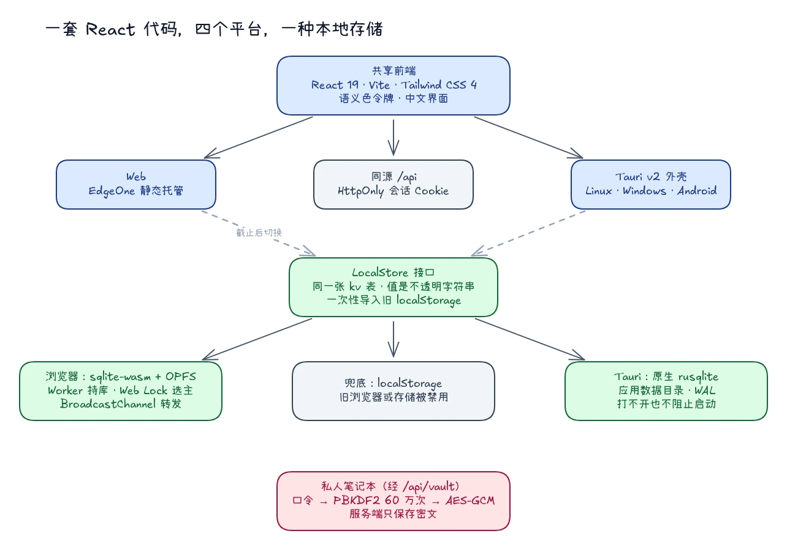

# 跨平台智能体客户端的实现：Web、桌面端与移动端

TJUClaw 的用户会在三种场景里打开它：课间用手机翻一眼笔记，在宿舍的电脑上让 Agent 整理实验数据，或者在机房随手打开一个网页。我们只有一个客户端仓库，要同时照顾这三种场景。

Electron 意味着上百兆的安装包；每个平台各写一套，又很快会变成「手机上有的功能电脑上没有」。我们最后的做法是：**一个 React 仓库，用 Tauri v2 打包成 Linux、Windows 和 Android 应用，Web 端直接部署同一份构建产物。**

---

## 1. 技术矩阵：React 19 + Tauri v2



*图：共享前端同时发布为 Web 与 Tauri 应用；所有平台通过同一个 `LocalStore` 接口使用 SQLite 本地存储。*

| 层 | 选型 |
| --- | --- |
| 视图 | React 19、TypeScript、Tailwind CSS 4、Lucide 图标 |
| 构建 | Vite 8 |
| 编辑器 | CodeMirror 6（Markdown 源码）与 Tiptap（富文本） |
| 原生外壳 | Tauri v2（Rust） |
| Web 托管 | EdgeOne 静态托管，`/api/*` 同源回源 |

为什么是 Tauri 而不是 Electron？

1. **体积与内存**：Tauri 不捆绑 Chromium，直接复用系统 WebView（Windows 的 WebView2、Linux 的 WebKitGTK、Android 的系统 WebView），安装包从上百兆降到十几兆；
2. **能力按来源授予**：Tauri 的每项原生能力都要在 capability 文件里显式声明。打包在应用里的页面只能读取版本号和使用本地存储；桌面窗口加载的产品站点 `https://app.tjuclaw.cloud` 另外只多了应用内更新和本机沙箱这几条命令。没有开放任何通用的文件系统、Shell 或网络插件，CSP 与 Web 端保持一致；
3. **一套业务代码**：除平台外壳配置外，组件、状态与样式全部共享。

---

## 2. 登录后是一个知识工作区

客户端的主体不是任务列表，而是 **Markdown 知识工作区**：

- **左栏**：知识库切换、条目树（笔记、文件、分组可以任意嵌套和拖拽排序）、会话列表；
- **中栏**：Markdown 编辑器或 Agent 会话，标题与正文防抖自动保存；
- **右栏**：笔记信息与实时解析的文档目录。

同一棵条目树里还放着其他工作流：

- **Agent 会话**：模型可以读写笔记、调用校园工具、检索公开知识库、读取原图。发送是乐观的：消息立刻出现在记录里，输入框立刻清空，网络重试沿用同一个请求 ID，服务端已经保存的回复不会被执行第二次。检索结果里的论坛原图通过带登录校验的同源代理显示，渲染时由 DOMPurify 移除其他外部图片地址；
- **笔记版本历史**：每篇笔记都镜像到用户自己的 Git 仓库，可以按提交查看旧版本并一键恢复；
- **校园小工具**：课表、考试、GPA、学期周次、自习室、论坛，使用用户自己绑定的校园会话；
- **记忆卡片**：牌组、模板与复习记录，可导出为 Anki 兼容格式；
- **发布与接入**：整个知识库可以发布为只读快照，其他用户在「市场」里发现并接入。

在设置里，用户可以切换产品模型，也可以填写自己的 OpenAI 兼容 API；Key 只保存在服务端，浏览器不会再看到它。模型选择的下一次调整待发布：普通账号可选 `deepseek-flash` 与 `gemini-3.8-flash-tiered`，界面直接显示接口名称，不再使用别名。

移动端把左栏收成抽屉，编辑器与会话保持同一信息架构。

### 思维链：先给一行摘要，想看再展开

Agent 回答之前做了什么，用户有权知道，但不应该被迫读完。每条回复上方只有一行摘要，例如「已思考 · 使用了 读笔记 · 检索资料 · 命令」；展开后是一条时间线，每一步思考、每次工具调用各占一行，工具行再点开才显示参数与结果。失败的步骤单独标红，不会被一句流畅的回答掩盖掉。

这条时间线在手机上出过一个问题：展开一段很长的命令输出后，整个对话栏被撑到比屏幕还宽。原因是回复与步骤列表都是 CSS Grid，默认的 `auto` 轨道会按内容的最小宽度撑开。把三处网格改成 `grid-template-columns: minmax(0, 1fr)` 后，长内容只在自己的代码块里横向滚动。这个问题是在给文档截图时发现的，现在截图脚本会顺带检查回复没有超出屏幕宽度。

---

## 3. 桌面端：让 Agent 在自己的电脑上运行

桌面端可以在「设置 → 模型」里把 Agent 的运行位置从云端切到本机。检测到 Docker 后，客户端会：

1. 向 API 申请一个 12 小时有效、绑定当前用户的运行时授权；
2. 在本机启动一个只监听回环地址的网关容器，并建一个 Docker `--internal` 网络，每个会话的执行容器都挂在这个没有外网路由的网络上；
3. 每一轮对话仍由 API 开启和结束：API 签发本轮的工具授权、检查配额，回合结束后把回复与思考步骤写回会话。

模型密钥始终留在服务端。本机网关只能用运行时授权访问 API 提供的模型代理，并且只能选产品模型；笔记、校园工具和检索这些工具也仍由 API 执行，用的是用户自己本轮的身份。换句话说，本机沙箱只负责「在哪里跑命令」，不改变「谁有权做什么」。

镜像按摘要钉死、首次使用时下载；Docker 没装或没启动时，界面会直接说明，而不是让一轮对话静默失败。

---

## 4. 私人笔记本：服务端只保存密文

有些笔记不应该被服务器读到。私人笔记本在客户端完成全部加解密：

```text
用户口令（6~64 位）
    │  PBKDF2-SHA-256，60 万次迭代
    ▼
  主密钥 ──► 每次写入生成独立的数据密钥 ──► AES-GCM
                                              │
                                              ▼
                              /api/vault/objects/{id}
                              服务端只存密文，不解密、不索引
```

几条工程细节：

- 口令本身和明文都不会被持久化；
- 写入采用按版本的条件更新；网络断开时，客户端会先读回远端内容再判断这次保存是否其实已经成功，避免把「响应丢了」误判为「写入失败」而重复写；
- 删除先留墓碑，直到对象确认消失；目录索引的合并只在确认冲突时进行一次。

需要说明的是，端到端加密目前只覆盖私人笔记本；普通工作区笔记仍以明文保存在服务端。工作区口令页如实告诉用户这一点：口令用于解锁工作区，模型服务可以改用自己的 API，「服务器只保存加密后的笔记」仍标注为即将推出。

---

## 5. 本地存储：从零散的 localStorage 到 SQLite

客户端里原本散落着不少 `localStorage` 用法：外观偏好、侧栏排序、记忆卡片状态、小工具缓存、口令校验记录。它们容量有限、只能存字符串、无法查询，也无法在多个标签页之间安全地并发写入。

现在所有平台共享同一个 `LocalStore` 接口和同一张表：

```sql
CREATE TABLE kv (
  ns TEXT NOT NULL,
  key TEXT NOT NULL,
  value TEXT NOT NULL,
  updated_at INTEGER NOT NULL,
  PRIMARY KEY (ns, key)
) WITHOUT ROWID;
```

不同平台使用不同的 SQLite 引擎：

| 平台 | 引擎 | 要点 |
| --- | --- | --- |
| 浏览器 | 官方 `sqlite-wasm`，OPFS SAH-pool VFS | 数据库放在专用 Worker 里；OPFS 同一时间只能被一个 Worker 持有，所以各标签页用 Web Lock 选出一个主标签页，其余标签页通过 BroadcastChannel 转发请求；主标签页关闭后自动交接 |
| Tauri | 原生 `rusqlite` | 数据库位于应用数据目录，开启 WAL；即使数据库打不开，也绝不阻止应用启动 |
| 兜底 | `localStorage` | 旧浏览器或存储被禁用时使用 |

值一律是不透明的字符串：任何私密内容都必须先在调用方加密。首次切换时，旧 `localStorage` 数据会一次性导入，并记录已迁移的键，之后绝不覆盖更新的值。

这套存储已在真实 Chromium 中验证了多标签页共享、主标签页交接与刷新后持久化；现有页面的切换安排在比赛截止之后进行，以免在评审期间引入风险。它也为以后在本地用 SQLite 全文检索实现私人笔记的模糊搜索打下了基础。

---

## 6. 视觉系统：语义令牌与 OKLCH

界面既要有专业工具的秩序感，又要在明暗两种模式下都舒适。我们使用 **OKLCH 感知均匀色彩空间** 定义语义色令牌：

```text
data-theme   light | dark        跟随系统或手动指定
data-accent  mono  | blue        克制的中性色，或北洋蓝
```

- OKLCH 把明度与色度解耦，切换明暗模式时对比度更可控；
- 外观偏好由 `useAppearance` 统一管理，并通过 `StorageEvent` 在同源多标签页之间同步；
- 不引入主题库，完全依靠 CSS 自定义属性与 `data-*` 属性驱动。

登录页与工作区口令页使用一张介于蓝图和黑板之间的背景：深色网格、粉笔质感的线条，登录后还会识别当前已登录状态，提供直接进入工作区或退出登录的选项。所有交互元素都保留可见的焦点环，图标按钮都有可读的名称。

---

## 7. 安全会话流与同源契约

客户端遵守一条简单的规则：**所有接口请求都是同源的 `/api/*`。**

```text
浏览器 / Tauri
   │  credentials: 'same-origin'，cache: 'no-store'
   ▼
开发代理 / EdgeOne（只剥离一次 /api）
   ▼
Go API
   ├── HttpOnly、SameSite=Lax 的会话 Cookie
   ├── 状态修改请求的同源校验
   └── 统一机器错误码 {"error":{"id":"session_expired"}}
```

- **凭证永不进入 JavaScript**：会话令牌只存在于 HttpOnly Cookie 中；
- **原子化的验证码输入**：`OTPInput` 使用一个真实的原生输入框捕获输入，再投射到 6 个视觉单元格上，天然支持系统的一键填充、粘贴与全键盘导航，避免「6 个独立输入框」在移动端软键盘上的各种问题；
- **严格 CSP**：`img-src 'self'`、`connect-src 'self'`，外部图片只能经由服务端白名单代理加载。

---

## 8. 总结

这套客户端里没有什么新奇的技术：React 19 和 Tailwind CSS 4 做视图，Tauri v2 用十几兆的安装包覆盖 Linux、Windows 与 Android，会话令牌只待在 HttpOnly Cookie 里，私人笔记在浏览器里加密，本地存储统一到 SQLite。

真正花时间的是边界：哪些能力只给桌面窗口里的产品站点，哪些数据只能以密文离开设备，哪一步必须回到服务端确认。这些决定让同一份代码在四个平台上表现一致，也让以后加能力时有据可依。
