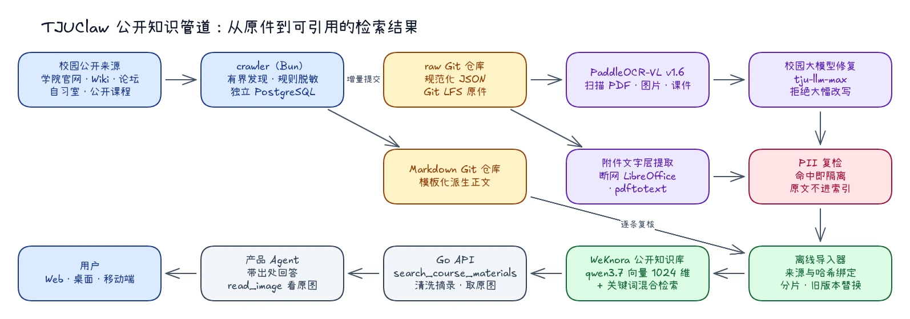
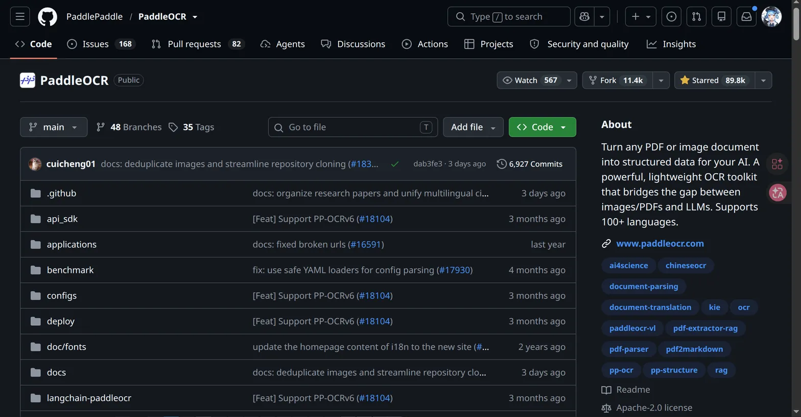
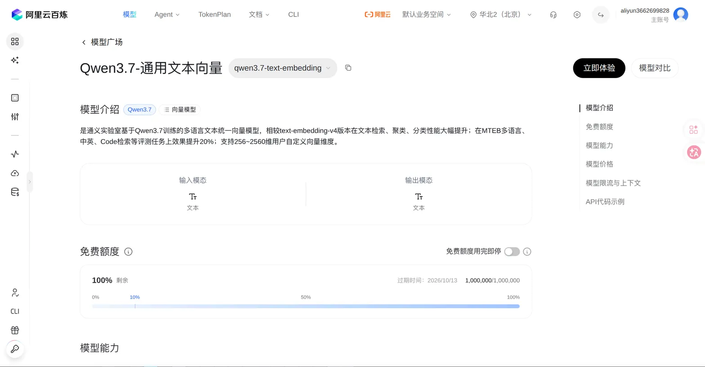
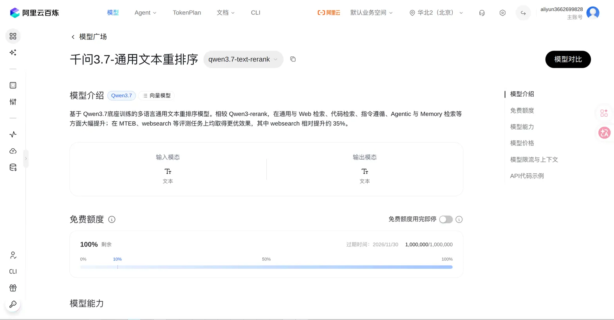

# 《数据的复杂采集、脱敏、归一与向量化》

做一个校园知识库，最容易产生的错觉，是认为问题可以被简化成：

```text
PDF → 切片 → Embedding → 向量数据库
```

真正做下去以后，会发现 Embedding 几乎已经是整条链路里最靠后的部分。

在它之前，还有 HTML、动态列表、论坛帖子、课程网盘、扫描 PDF、旧版 PPT、没有扩展名的下载流；有重复文件，有随时可能修改的通知，有「文件名写着 `.docx`、打开却是一张 404 网页」的附件，也有混杂在公开材料里的邮箱、手机号、学号甚至配置密码。

如果直接把这些东西扔进知识库，得到的并不是「校园知识」，而是一堆来源不稳定、格式不统一、无法复核，也很难安全使用的文本碎片。

所以 TJUClaw 需要的不是一个「能够搜索 PDF 的网站」，而是一条完整的数据管道。截至 2026 年 9 月底，它的真实形态如下：



*图：公开知识管道。采集、原件仓库、离线归一、导入与检索各自独立，任何一段失败都不会迫使前一段重跑。*

Agent 最终看到的，也许只是一次工具调用：

```json
{ "name": "search_course_materials", "arguments": { "query": "软件工程培养方案" } }
```

但这一次调用真正依赖的，是前面那条并不显眼的数据基础设施。

---

## 向量化以前，先解决数据到底是什么

校园公开数据有一个很明显的特点：**它并不是作为「数据集」存在的。**

目前 TJUClaw 的公开语料来自五类渠道：

| 渠道 | 形态 | 原始条目（2026-09 快照） |
| --- | --- | --- |
| 微北洋论坛 | 帖子正文 + 标签 + 原图链接 | 61,620 |
| 学院与职能部门官网 | HTML 新闻、通知及其附件 | 23,667 |
| 公开课程资料 | 网盘式目录，附件 2,600 余份 | 2,498 |
| 校园 Wiki | 结构化说明页及附件 | 1,284 |
| 自习室 | 结构化空闲教室数据 | 589 |

这些来源的更新周期、结构稳定性和访问方式完全不同。

因此我们没有试图寻找一个能够统一处理所有来源的「万能爬虫」，而是先把问题拆开：

**采集阶段只负责发现和保存事实，归一阶段再负责理解文件。**

如果文档处理和模型调用全部塞进抓取流程，一份较大的扫描 PDF 就足以阻塞后面整个学院站的更新。反过来，如果抓取器只负责把原始对象可靠保存下来，那么 OCR 暂时跑不完、模型服务受到限流，甚至以后更换处理方案，都不会要求重新访问源站。

原件是事实。

Markdown 和向量都是派生物。

先保存事实，再决定怎样解释它。

---

## 采集不是越快越好

对于几十个共享同一出口的校园网站，`Promise.all(sources.map(crawl))` 通常不是一个好主意。

很多学院站本身并没有为大规模并发访问设计。数据晚几分钟进入知识库几乎没有区别；但一次性并发扫几十个站点，对对方服务器和自己的出口都会产生没有必要的压力。

因此 TJUClaw 的 crawler（Bun 编写，使用独立的 PostgreSQL）更像一个非常克制的轮询器：

```text
source A ── 每小时
source B ── 每天
source C ── 每天
...
```

调度器寻找已经到期的源，一次处理一个；失败后退避，而不是立刻重试；同一主机之间保留最小请求间隔。所有出站请求都经过同一个防 SSRF 的 HTTP 客户端，不会被一条恶意链接引向内网地址。

这使得爬虫在绝大多数时间里显得相当「无聊」：CPU 占用很低，连接数也不多。

但这恰恰是我们想要的状态。采集公开数据没有必要变成压力测试。

---

## 最危险的不是漏抓，而是把「没抓到」理解成「已经不存在」

在动态网站里，一个非常容易被忽略的问题是：

> 一次抓取结果，是否代表远端完整状态？

很多时候答案是否定的。分页接口可能超时，学院网站可能临时返回 500，课程目录枚举可能因为部署重启只跑到一半。

如果把每一次抓取都当作远端世界的完整快照，就会出现非常糟糕的结果：

```text
这次只抓到 20 条
↓
数据库原来有 3000 条
↓
剩下 2980 条被判断为「已删除」
```

因此，动态数据源默认都是：

```text
complete = false
```

含义不是「任务失败」，而是：

> 我只能证明这些东西存在，不能证明没出现的东西已经不存在。

只有能够确认完整枚举的数据源，才有资格删除不存在于新快照中的历史记录。

对于增量消费，我们另外维护单调递增的事件游标。它不是对方网站分页接口提供的 token，而是自己数据库中的事件编号：

```text
upsert article → event 12031
upsert article → event 12032
delete article → event 12033
```

RSS、Git 同步侧车与导入器读取的是自己的事件流，而不是把第三方网站的分页行为当成可靠状态机。这让采集系统从「定时脚本」变成了可以重放的数据源。

同样的教训后来在导入端又出现了一次：WeKnora 的知识列表按时间倒序分页，并发导入时总数会增长，替换旧版本时总数又会减少。导入器因此只接受「增长时重叠、减少时整轮重扫」，绝不把一次不完整的列表当成服务器的真实状态。

---

## 两个 Git 仓库：原件与派生正文分开保存

采集数据最终以两条增量提交流的形式落进两个私有 Forgejo 仓库：

```text
raw 仓库
├── sources/<kind>/<source>/<slug>/<itemHash>.json      规范化后的原始条目
└── sources/<kind>/<source>/<slug>/<itemHash>.attachments/<sha256>
                                                        Git LFS 保存的附件原件

markdown 仓库
└── sources/<kind>/<source>/<slug>/<itemHash>.md        模板化的派生正文
```

路径里的每一段都可以被验证：`itemHash` 是条目 ID 的 SHA-256，附件文件名是附件字节的 SHA-256。导入器在读取任何一篇 Markdown 前，都会反查 raw 仓库里的 JSON，确认来源、条目 ID 与路径哈希一致，并重新渲染一次模板，与 Markdown 仓库中的正文逐字比对。任何一处对不上，这篇文档就不会进入知识库。

Git 带来的好处很朴素：每一次采集都是一次可以 `diff`、可以回退、可以在离线工作站完整拉取的提交；大文件通过 Git LFS 进入对象存储，仓库本身保持轻量。

---

## 内容寻址：版本不会因为源站修改而消失

附件不按照原文件名寻址，而是按照内容哈希：

```text
SHA-256(file bytes)
```

同一份培养方案即使同时被三个学院网站转载，也只需要保存一次。

更重要的是，**版本不会因为源站修改而消失。** 一份通知今天被修改，新的版本会产生新的哈希；检索系统更新到新版，但以前生成的引用仍然可以指向旧的字节序列。

这意味着「引用」不再只是一个 URL，它指向的是某一个确定的字节序列。

---

## 不要相信 `.docx`

课程和官网资源里有一种很常见的情况：URL 写着 `lecture.pdf`，服务器实际返回的却是 HTML 错误页面。

2026 年 9 月我们第一次把官网与 Wiki 的 630 个附件全部拉到本地时，这个问题被量化得非常直观：

| 按文件内容判定的类型 | 数量 |
| --- | --- |
| 实为 HTML 网页（错误页、登录页） | 449 |
| PDF | 62 |
| 图片（PNG / JPEG / WebP） | 64 |
| Word（`.doc` / `.docx`） | 40 |
| Excel（`.xls` / `.xlsx`） | 15 |

扩展名为 `.doc` 的 186 个文件里，绝大多数根本不是 Word 文档。

所以文件类型只看文件头：

```text
%PDF            → PDF
PK\x03\x04      → OOXML（再看 word/ 或 xl/ 部件）
\xD0\xCF\x11\xE0 → 旧版 Office 复合文档
\x89PNG / \xFF\xD8\xFF / WEBP → 图片
```

这不是什么复杂技术，但对于一个长期运行的数据入口来说，这种无聊的检查往往比后面的模型能力重要得多。入口越宽松，后面需要处理的垃圾就越多。

---

## 脱敏并不是「一条正则」

校园公开资料还有另一个麻烦：

**公开可访问，不意味着所有内容都适合进入一个可以自然语言检索的知识库。**

信息原本可能埋在一份几十页 PDF 的附表里。一旦被切片、向量化，再允许模型直接搜索「帮我找一下某某的联系方式」，信息的可访问性就发生了变化。

因此，TJUClaw 把脱敏分成多道关口，而且都在进入模型或索引之前发生：

1. **采集落库前**：命中私钥、代码托管令牌、`password=` 之类凭据，以及身份证号、名单结构的大批学号或手机号，整条内容只保留「隔离资料」占位，原文不入库、不进 OCR、不生成派生 Markdown。
2. **OCR 产出后**：识别出的文字在交给任何模型修复之前再扫描一次，命中同样丢弃原文。
3. **导入前**：导入器对最终要写入知识库的全文再做一次扫描。论坛帖子更严格：只导入最近一年内发布的帖子，出现任何手机号都不导入；官网正文中的办公电话属于公开服务信息，可以保留。

规则的优点很简单：**快，而且可以解释。** 同一段文本，无论什么时候进入系统，都会得到相同结果。

脱敏本质上不是寻找一个完美正则，而是在**信息可用性和重新聚合风险之间划一道边界**。这种边界永远不应该被描述成「零误报」：`password:` 很可能只是课程讲义中的示例，但对于公开知识库，我们宁愿隔离一份讲义，也不希望偶然放进去一组真实凭证。

---

## 归一：OCR 负责看清，模型只负责修补

最终进入知识库的统一表示是 Markdown。纯文本损失结构，HTML 混入大量样式和导航，JSON 对长文档既冗长又没有必要；Markdown 足以表达绝大多数校园文档的标题、列表、表格和引用，语法本身又非常轻。

不同来源走不同的归一路径：

```text
结构化条目（论坛、官网正文、Wiki、自习室）
    → 来源模板直接渲染 Markdown，不经过任何模型

扫描 PDF、图片、课件
    → PaddleOCR-VL v1.6 版面与文字识别
    → 校园大模型 tju-llm-max 修复断行、表格与标题层级
    → PII 复检

带文字层的 Office 文档与 PDF
    → 断网、只读的 LibreOffice 容器与 pdftotext 直接提取
    → 表格保留为 Markdown 表格
    → PII 复检
```



*图：扫描件与图片使用 PaddleOCR-VL 识别版面与文字，在维护者工作站上离线运行。*

这里有一条我们非常坚持的原则：

> **模型只修复无法确定恢复的结构，不改写已经正确的事实。**

每增加一次生成式处理，就增加一次文本漂移的机会。所以修复脚本写入独立的派生目录，从不原地改写 OCR 结果；它会拒绝疑似提示词泄漏的输出，也会拒绝篇幅大幅缩水的「重写」。对于知识库来说，「更漂亮」远没有「仍然是原文」重要。

OCR 与修复都不运行在生产 crawler 里。它们是维护者工作站上显式运行的离线任务，消费的是 raw 仓库里的对象哈希而不是 URL：失败可以反复重跑，而不需要再次访问源站；以后更换 OCR 模型，也只需要重新消费已有对象。截至 9 月底，2,616 份课程附件中已有约 1,430 份完成 OCR，其余仍在排队。

---

## 附件：文字层能直接读，就不交给 OCR

官网和 Wiki 附件里真正的文档只有 181 份，其中 Word、Excel 和带文字层的 PDF 占了大头。它们本来就有文字，送进 OCR 反而浪费算力、还可能引入识别误差。

于是这部分走一条更短的路：

1. `git lfs pull` 按路径只拉取官网与 Wiki 的附件；
2. 核对文件内容的 SHA-256 与文件名一致，按文件头判定类型；
3. Word 在 `--network none`、只读根文件系统、去掉全部 capability 的 LibreOffice 容器中转为文本，Excel 逐个工作表转成 Markdown 表格，PDF 用 `pdftotext` 读取文字层；
4. 提取结果写到独立目录，与原件保持同样的相对路径。

导入时，每个附件成为一条独立的知识条目：标题是「原文章标题（附件）」，出处链接指回原文章，条目 ID 形如 `<原条目 ID>#attachment-<sha256>`。它同样要通过来源校验与隐私扫描。第一轮共提取 113 份，112 份通过，1 份因隐私规则被拦下；64 张图片与少量扫描版 PDF 留给 OCR 队列。

---

## 论坛原图：不让知识库「消化」图片

论坛里有大量帖子，文字只有一句「如图」，真正的信息在图片里：失物招领的校园卡照片、课表截图、通知海报。

最初的做法是把原图写成 Markdown 图片语法放进正文。结果发现，WeKnora 在解析时会下载这些图片，并把地址改写成自己的内部资源引用。原始链接丢失，Agent 无法再引用或读取原图，知识库还要平白存下十几 GB 的图片。

现在的做法是：

- 正文只保留一句「（本帖附有 N 张原图）」，给语义检索留一个提示；
- 原图地址（只接受 HTTPS、只接受论坛自己的图床）作为 `image_urls` 写进条目元数据；
- 检索时，Go API 从元数据取出原图地址，连同摘录一起交给 Agent；
- Agent 需要理解图片时调用 `read_image`，由原生多模态的产品模型读图；需要展示时，前端通过带登录校验的同源图片代理加载，客户端的 CSP 仍然只允许 `img-src 'self'`。

同一帖子改用新格式重新导入后，导入器会删除服务器上该条目的旧版本，保证检索结果里不会出现两份内容相近、格式不同的副本。

---

## 切片与向量：结构先行

当所有文档都统一成 Markdown 后，向量化反而变成了一个比较普通的问题。

每篇文档在导入前都带着来源头：

```markdown
# 学生卡丢了

> 路径：wepeiyang-lake-posts > 学生卡丢了

- 来源：wepeiyang-lake-posts
- 原文：https://…
- 发布时间：2026-01-01
```

这样即使一个片段被单独召回，它仍然知道自己属于哪里。WeKnora 按 512 字、50 字重叠切分；返回给 Agent 之前，Go API 会把这些来源行和出处注释从摘录里剥掉，只留下正文，出处则作为独立字段返回。

模型分工如下：

| 阶段 | 组件 | 职责 |
| --- | --- | --- |
| 版面与文字识别 | PaddleOCR-VL v1.6 | 扫描 PDF、图片、课件的文字与版面 |
| 结构修复 | 校园大模型 `tju-llm-max` | 修复 OCR 断行、表格与标题，不改写事实 |
| 文档摘要 | 校园大模型 `tju-llm-max` | WeKnora 为每篇文档生成摘要片段 |
| 向量化 | Qwen3.7 通用文本向量（`qwen3.7-text-embedding`） | 1024 维语义向量 |
| 检索 | WeKnora 混合检索 | 向量召回 + 关键词召回 |



*图：Qwen3.7 文本向量模型支持自定义维度；当前选择 1024 维。*

Embedding 维度固定为 1024。更换模型或维度时，必须重建对应的 WeKnora 索引，不能把不同向量空间混在同一个集合中。向量一律由云端嵌入模型生成，本地嵌入服务只用于开发测试，不写入生产知识库。



*图：重排序模型已完成选型，但生产知识库目前尚未启用重排，排序由混合检索直接给出。*

「微积分 A(1)」与「微积分 B(1)」这样的课程名，完全依赖 Embedding 并不可靠；关键词召回解决「字符串就是很重要」，语义召回解决「意思相近」。两者合并，比任何一路单独使用都稳。

---

## 导入：可以中断，可以重跑，不会重复

九万篇文档不可能一次导完，导入器因此按「随时可以被杀掉」来设计：

- **来源绑定**：每条知识的元数据带 `source`、`item_id`、`source_url` 与正文哈希。上传超时后，导入器先在服务器上按这四个字段查找，找到就直接认领，绝不再传第二份；
- **本地清单**：每处理完一篇，就以 0600 权限原子写入清单，记录路径、正文哈希与知识 ID；正文没变的条目下次直接跳过；
- **稳定分片**：按路径的 SHA-256 取模分成多片，每片各自一份清单，可以并行跑而互不重叠；
- **失败重试**：嵌入服务短暂不可用导致的解析失败，会原地触发重新解析，而不是删掉重传。

截至 9 月 28 日，公开知识库已完成约六千篇文档的向量化，剩余部分正按分片持续导入；OCR 每完成一批，定时任务就会把新产出的 Markdown 补进来。

---

## 一个公开知识库，而不是几十个学院知识库

用户的问题不会按照组织架构出现。「转专业以后培养方案里的高数怎么认定？」可能同时涉及学院通知、教务规定和培养方案。

因此公开校园语料进入同一个 WeKnora 知识库，来源差异保存在元数据中，需要时过滤，而不是提前把知识物理拆散。

用户自己的笔记则走另一条完全独立的路径：

```text
公开校园知识 → WeKnora（派生索引，不是正文来源）
用户私人知识 → TJUClaw Go API 与按身份归属的存储
```

我们不希望为了方便检索，把公共数据和用户数据混成一个身份空间；WeKnora 也从不作为产品身份或资料库权限的依据。

---

## 搜索是一种 Agent 工具，而不是产品终点

这套知识库主要不是为了让人打开一个搜索框，真正的消费者是 Agent。

在产品里，Agent 通过 `search_course_materials` 工具检索公开知识库。Go API 调用 WeKnora 的混合检索后，返回的是一个确定的结构：

```json
{
  "hits": [
    {
      "title": "教学楼拾到校园卡",
      "kind": "summary",
      "excerpt": "……已将校园卡送至失物招领处……",
      "images": ["https://…/download/origin/…"],
      "source_url": "https://…",
      "source": "wepeiyang-lake-posts",
      "score": 0.016
    }
  ]
}
```

- `kind: "summary"` 表示命中的是 WeKnora 生成的文档摘要，标题换成文档本身的标题；
- `images` 只包含 HTTPS 原图，Agent 可以把它交给 `read_image`，或者用 Markdown 图片语法展示给用户；
- `source_url` 经过协议白名单过滤，不会把 `javascript:` 之类的链接交给前端。

在命令行和沙箱里，同样的能力由 `tjucli knowledge search` 提供，返回同一种带出处的 JSON 信封。

LLM 不负责寻找所有事实。它负责使用检索系统已经找到、并且带有出处的事实。

---

## 引用最终应该指向一个哈希

整条数据链路最后还有一个问题：**如果原网页后来变了怎么办？**

搜索系统应该始终指向最新版本：

```text
(source, item_id) → 最新的 Canonical 文档
```

但一次已经生成的引用应该保存正文哈希或附件的 SHA-256。于是两个需求可以同时成立：

```text
搜索 → 应该看到最新内容
引用 → 应该看到当时内容
```

对于一段进入知识库的内容，我们最终希望知道的不只是「它说了什么」，还包括：它来自哪里、什么时候抓到、是哪一版、经过了哪些处理、对应的原始文件是什么。

这些字段不会让 Embedding 本身更准确，但它们决定了一套知识系统是否值得信任。

---

## 写在最后

做完这条链路以后，我越来越觉得，RAG 系统里最重要的部分往往不是 RAG。

Embedding、向量数据库、混合检索都已经有成熟的实现。真正需要不断做工程判断的，是它们之前那些不那么显眼的问题：

- 什么时候相信一次抓取是完整的？
- 文件名和文件内容冲突时相信谁？
- 一份公开材料里出现手机号以后，它是否还应该进入自然语言搜索？
- 文档结构的问题应该由规则修、由 OCR 修，还是让模型修？
- 一张图片应该被知识库「消化」，还是保留原样交给会看图的模型？

TJUClaw 目前选择的是一条相对保守的路线：

```text
原始数据尽可能保存
派生过程尽可能可重放
生成式处理尽可能少
每一次检索尽可能带出处
每一次引用尽可能落到确定版本
```

复杂性没有消失，它只是被压到了一次工具调用下面。

---

## V1 爬虫结果

V1 爬虫已经将五个渠道的原始条目与归一化 Markdown 同步到 Git 仓库，并对附件对象、类型、页数预览和条目字符数进行了只读统计。下面的报告来自 Git 镜像与 crawler 归档数据库的同一轮快照：字数分布扫描 Markdown 仓库中的全部 `89,566` 个正文条目，附件目录不会被重复计入。

报告保留为独立的 Apache ECharts 静态页面，方便在文章内交互查看，也可以[单独打开完整报告](/reports/crawler-statistics/index.html)。

而这大概就是数据基础设施应该做的事情。
