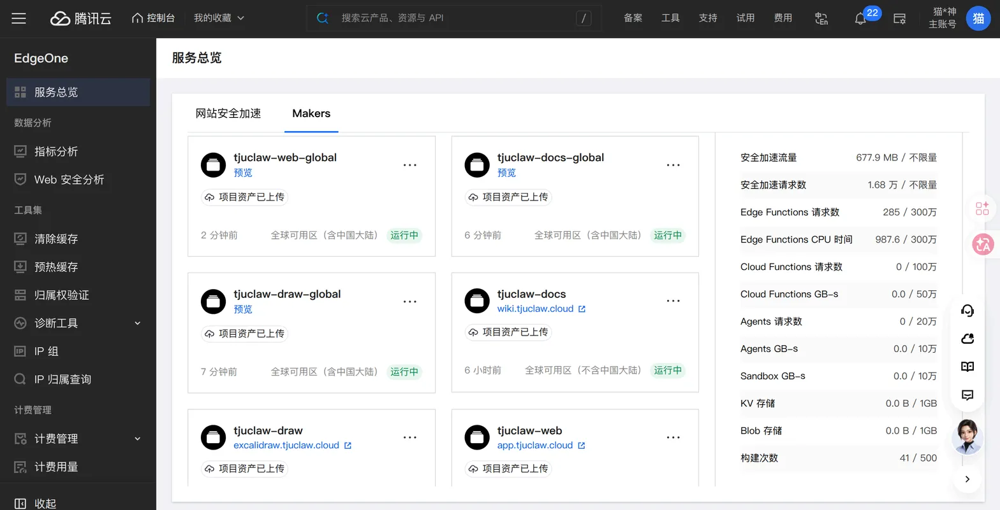

# 《从代码仓库到持续交付：TJUClaw 的仓库划分与 CI/CD》

拆成五个仓库不是审美决定，是三条约束打架的结果：客户端要能公开，服务端不能公开，比赛镜像必须落在 GitLab 的私有项目里。单仓库无论怎么切目录，都会让其中一条落空——比赛官网 FAQ 写明私有项目影响 Star 与下载量记分，所以镜像仓库没有走向公开。

代价同样是真的：跨仓改动的传播路径变长，版本号不再天然对齐，集成仓库里只留得下四个 gitlink SHA。

## 1. 仓库拓扑

```text
yunzaixi-dev/tjuclaw                       集成仓库（Private）
├── docs/            Next.js + Fumadocs 文档站，output: 'export'，产物 docs/out
├── draw/            静态 Excalidraw 画板（独立 package.json，0.0.1）
├── frontend/  ──submodule──▶ tjuclaw-client   （Public，React 19 + Vite 8 + Tauri 2）
├── backend/   ──submodule──▶ tjuclaw-server   （Private，Go 1.27）
├── cli/       ──submodule──▶ tjucli           （Private，Go 1.27）
├── crawler/   ──submodule──▶ tjuclaw-crawler  （Private，Bun 1.3.14）
├── scripts/         git 策略、GitLab 同步/发布/状态回写、部署脚本
└── ops/             Ansible roles 与 playbooks、Compose 示例

release 分支 push / v* 标签
   │
   ▼  GitHub Actions（唯一 CI）
   ├──▶ 单向镜像：只推 release 与 vX.Y.Z 标签，单 ref、不 force ──▶ gitlab.tju.edu.cn 项目 145
   ├──▶ 客户端安装包上传 GitLab Generic Package Registry
   └──▶ 状态回写 github-actions/ci
```

| 仓库 | 位置 | 可见性 | 技术栈 | 职责 |
| :--- | :--- | :--- | :--- | :--- |
| `yunzaixi-dev/tjuclaw` | 根 | Private | Taskfile、Next.js (Fumadocs)、Ansible | 集成版本与组件 gitlink、文档站、画板、真实认证回归、GitLab 同步与 Release |
| `tjuclaw-client` | `frontend/` | Public | React 19、Vite 8、Tailwind 4、Tauri 2 | 跨端界面、UI 与工作区回归、Web / Linux / Windows / Android 打包 |
| `tjuclaw-server` | `backend/` | Private | Go 1.27.0、pgx/v5、PostgreSQL | 业务 API、Kratos 会话核验、Cap 校验、条目与任务归属 |
| `tjucli` | `cli/` | Private（`ops/ci/README.md` 里标注为暂定） | Go 1.27.0 | 公开课目录检索与下载、tool server |
| `tjuclaw-crawler` | `crawler/` | Private | Bun 1.3.14、独立 PostgreSQL | 公开来源采集、附件镜像、RSS 与 Replay 增量回放 |

`draw/` 是集成仓库里的普通目录，不是 submodule，有自己的 `package.json`（0.0.1）。

版本来源是各仓库自己的根 `package.json`：集成仓库 0.0.27，客户端 0.0.27，后端、CLI、crawler 都是 0.0.26。这个差异是设计而不是跑偏——集成仓库锁的是组件的 gitlink SHA，不是版本号。仓库里没有另一个 `VERSION` 文件；客户端 `src-tauri/Cargo.toml` 的 crate 版本固定 0.0.0，只作内部元数据，Tauri 读的是 `frontend/package.json`。

两条长期分支：`release` 是生产分支，同时就是日常快速迭代分支；`dev` 保留为集成验证分支。生产部署只认 `release`：工作流里的分支条件、仓库的 production 环境保护（`DEPLOY.md` 要求它只允许 release 分支）与本地脚本三者共同约束，而 `CONTRIBUTING.md` 明确本地脚本不能代替服务端规则。

`.gitmodules` 里只有 `crawler` 多一行 `branch = release`，另外三条只写了 URL。这个差别有实际影响：`git submodule update` 按记录检出 SHA，组件目录是 detached HEAD。改组件的顺序只能是先在组件仓库提交并推送，再回集成仓库逐路径暂存那个 gitlink。旧 GitLab → GitHub 的反向镜像已停用，`ops/ci/README.md` 明确禁止与新方向同时启用。

## 2. 提交契约由两个 hook 执行

hooks 放在版本控制的 `.githooks/` 里，由 `task setup`（即 `pnpm git:setup` → `scripts/setup-git.mjs`）把当前仓库的 `core.hooksPath` 指过去。它不改全局配置，发现已有其他 hooksPath 会直接拒绝；新克隆或新机器要重装。

| hook | 脚本 | 拦什么 |
| :--- | :--- | :--- |
| `pre-commit` | `scripts/git-policy.mjs check-index` | `git diff --cached --check` 的空白错误；以及索引里的受限路径 |
| `commit-msg` | `scripts/git-policy.mjs commit-msg` | 标题格式、emoji 与 type 的对应、版本与暂存 `package.json` 的一致性 |

受限路径不是示意的：`CONTEXT.md`、`private/`、`research/`、`ops/local/`、`scripts/*intelligence*`、`frontend/public/audits/`、非 `.example` 的 `.env*`、`*.key` / `*.pem` / `*.sqlite` / `*.keystore`、任何含 `.private.` 的文件名，命中就拒绝提交。检查范围是整个 Git 索引，所以 `git add -f` 绕不开常规 ignore 之后仍然过不了这一关。

提交标题必须匹配：

```text
EMOJI [vMAJOR.MINOR.PATCH] type(scope): summary
```

emoji 与 type 一一对应：feat ✨、fix 🐛、docs 📝、refactor ♻️、perf ⚡、test ✅、chore 🔧、ci 👷、build 🚀、revert ⏪（其余 type 一律拒绝）。版本必须等于暂存区里的 `package.json`，脚本读的是 `git show :package.json` 而不是工作区文件——先改文件不提、再写一个更高的版本号，钩子会拦住。标题上限 100 个码点，首尾不留空格，`!` 可以放在 type 或 scope 后表示不兼容变更。

显式暂存这条规则不是风格偏好：集成仓库同时挂着四个 submodule 指针，`git add .` 极易顺手带上不该提交的本地状态。`CONTRIBUTING.md` 因此禁止 `git add .` 与 `git add -A`，要求逐路径暂存、先看 `git diff --cached` 再提交。

两个 hook 都只覆盖本地提交路径。`CONTRIBUTING.md` 自己写清楚了边界：钩子不验证远端标签、版本递增或发布状态，可以被绕过，也不是内容级密钥扫描——它能发现索引里的受限文件名，发现不了普通 Markdown 正文里的凭据。发现已泄露的凭据，先轮换，再谈历史。

## 3. 集成 CI

集成仓库有七个工作流：`ci.yml` 是主流水线，`deploy.yml` 只被它调用，`deploy-docs.yml`、`deploy-draw.yml`、`deploy-crawler.yml` 负责三类部署，`release.yml` 处理 GitLab 发版，`gitlab-status.yml` 回写状态。`ci.yml` 的触发条件是 push 到 `dev` / `release` / `v*` 标签，以及针对 `dev` / `release` 的 PR。五个 job 分工如下。

| job | 运行条件 | 实际做的事 |
| :--- | :--- | :--- |
| `mirror` | 仅 release push 或 `v*` 标签，限时 5 分钟 | `scripts/gitlab-sync.mjs` 校验仓库名、40 位 SHA、ref 只允许 `refs/heads/release` 与 `refs/tags/vX.Y.Z[-后缀]`，然后单 ref 原子推送，不用 force |
| `check` | 全部触发，限时 30 分钟 | 见下 |
| `integration` | 全部触发，限时 45 分钟 | 真实 Kratos 认证与任务归属验收 |
| `ops` | 全部触发，限时 15 分钟 | 11 个 playbook 的 `--syntax-check` + 回滚回归测试 |
| `deploy` | `needs: [check, integration, ops]`，且仅 release push | 复用 `deploy.yml`，见第 5 节 |

`check` job 的几个具体选择：组件用 `.github/actions/checkout-components` 检出——它先 `git ls-tree HEAD` 断言四个条目的 mode 是 `160000`，再按 SHA 分别拉取，服务端、CLI、crawler 用三个互相独立的只读 deploy key，客户端没有 key（公开仓库）；PostgreSQL 走 GitHub Actions 的 `postgres:17-alpine` service 容器，只暴露动态端口；接着 apt 装 `ffmpeg poppler-utils webp python3 python3-pil` 供媒体与文档处理测试使用。

然后是 `task check`。它没有藏在 YAML 里的临时命令，全部来自根 `Taskfile.yml`：

```text
task check
├── lint       pnpm lint（ESLint） + go vet（backend、cli） + bun run check（crawler 类型）
├── types      pnpm types:check
├── test       test:git（提交策略单测）、test:tooling、audit:test
│              go test ./...（backend）、go test -race ./...（cli）
│              crawler 对隔离 PostgreSQL 的集成测试、go test ops/auth/mail_test.go
└── git:check  scripts/git-policy.mjs check-index
```

Go 侧只有 `go vet` 和标准测试，仓库里没有任何 `staticcheck` 之类的额外静态分析器引用。`task check` 里的 `go test ./...` 不带 race 检测，所以 CI 把它单列成一步：

```bash
(cd backend && go test -race ./...)
(cd cli && go test -race ./...)
```

之后 job 构建交付物（`task docs:build`、`task api:build`、`task cli:build`），再用固定参数产出 API 制品并生成溯源元数据：

```bash
cd backend && CGO_ENABLED=0 GOOS=linux GOARCH=amd64 go build -trimpath -o bin/deploy/api ./cmd/api
node scripts/deploy-release.mjs --manifest   # 写 metadata.json + SHA256SUMS
```

制品以 `api-<sha>` 为名上传，保留 14 天。

`integration` job 是整条流水线里唯一不接受替代品的部分。它预拉取五个钉死版本的镜像——`oryd/kratos:v26.2.0`、`postgres:16.14-alpine`、`axllent/mailpit:v1.27.8`、`tiago2/cap:3.1.11`、`valkey/valkey:9-alpine`——装上 Chromium，先跑 `task compose:config` 与 `task compose:context` 验证 Compose 配置与 Docker 构建上下文只包含批准输入，再跑 `task auth:test`：真实的身份中心、Valkey、无头浏览器，走登录、发信、取码、开会话的完整链路。收尾用 `node scripts/auth-test-stack.mjs --down` 拆掉测试栈，这一步是 `if: always()`，测试失败也要清干净。

需要说清楚的是「不用 mock」的边界：真实认证不用 mock 替代（`ops/ci/README.md` 的原话），但客户端的工作区回归 `task workspace:test` 明确就是隔离 mock，浏览器回归跑的是真实构建产物。这两件事不是同一个东西。

`ops` job 的 syntax-check 覆盖 `discover`、`render-origin`、`prepare-services`、`deploy-identity`、`deploy-newapi`、`deploy-newapi-origin`、`deploy-api`、`deploy-crawler`、`deploy-cap`、`deploy-zitadel`、`deploy-weknora` 共 11 个 playbook，随后跑 `node --test ops/ansible/tests/*.test.mjs scripts/deploy-release.test.mjs`。

`.github/workflows/gitlab-status.yml` 单独一个工作流，由 `workflow_run` 在 `CI` 完成后触发，但只在 `vars.GITLAB_STATUS_ENABLED == 'true'`、且是本仓库 release push 的情况下执行，用项目级令牌把 `github-actions/ci` 状态回写到 GitLab，保留跳回 GitHub 运行的链接。镜像与状态回写是两件独立的事：镜像推的是代码，状态回写推的是「这次提交在哪儿验证过」。

所有 Action 都钉到 commit SHA，没有一处写可变的 `@v4`：

```text
actions/checkout           11d5960a326750d5838078e36cf38b85af677262  # v4
actions/setup-node         49933ea5288caeca8642d1e84afbd3f7d6820020  # v4
actions/upload-artifact    ea165f8d65b6e75b540449e92b4886f43607fa02  # v4
actions/download-artifact  d3f86a106a0bac45b974a628896c90dbdf5c8093  # v4
actions/setup-go           40f1582b2485089dde7abd97c1529aa768e1baff  # v5
pnpm/action-setup          b906affcce14559ad1aafd4ab0e942779e9f58b1  # v4
astral-sh/setup-uv         20cfd1bf945f4377ade1205e4dbc17946fc9a30d  # v10.0.1
oven-sh/setup-bun          0c5077e51419868618aeaa5fe8019c62421857d6  # v2.0.1
docker/setup-buildx-action b5ca514318bd6ebac0fb2aedd5d36ec1b5c232a2  # v3.10.0
docker/build-push-action   471d1dc4e07e5cdedd4c2171150001c434f0b7a4  # v6.15.0
```

这份清单同时是外部状态：GitHub 仓库侧的 Actions 白名单必须包含每一个用到的 SHA，否则工作流会在启动前失败，连当前分支上本来会跳过的 job 也救不了它。2026-09-10 加 `download-artifact` 与 `setup-uv` 时就撞过一次 `startup_failure`，本地 actionlint 查不出这类问题。

顺带一个容易忽略的细节：`mirror` job 在标签推送时会把 `ref` 显式传给 checkout，因为 checkout v4 默认的浅抓取会把附注标签拍平成 `github.sha`。首个 `v0.0.25` 的 GitLab 标签因此是轻量标签，指向的源码提交与 GitHub 完全一致，但附注对象丢了；后续标签显式检出 tag ref，已发布版本的引用和文件内容保持原样不改写。

## 4. 四端构建与两步发版

客户端仓库自己有一套工作流：`ci.yml`（`check`、`browser`、`build-artifacts`、`build-linux`、`build-android`，外加调用 `deploy-edgeone.yml` 的 `deploy-web`）、`windows.yml`、`deploy-edgeone.yml`、`packages.yml`，以及手动把下载挂到客户端 GitHub Release 的 `publish-downloads.yml`（与下面的 GitLab 两步流程相互独立）。

四个平台产出的东西不一样：

| 平台 | 命令 | 产物 |
| :--- | :--- | :--- |
| Web | `task web:build` | `dist/`，以 `web-<sha>` 上传 |
| Linux amd64 | `task linux:build`（`tauri build --bundles deb`） | `.deb` |
| Windows x64 | `task windows:build`（`tauri build --bundles nsis`） | 未签名的 NSIS `.exe` + `SHA256SUMS.txt` |
| Android arm64 | `task android:build`（`--debug --apk --target aarch64`） | 调试 APK |

只改服务端不会触发四端重打包：客户端工作流只认客户端仓库自己的 push。集成 CI 里仍然会构建 Web，因为 `task auth:test` 的第一步就是 `task web:build`——真实认证回归跑在真实构建产物上。

发版是两个人工触发的步骤，顺序不能反：

```bash
# 第一步：在客户端 release 上，传入集成仓库锁定的 frontend SHA
gh workflow run packages.yml --repo yunzaixi-dev/tjuclaw-client --ref release \
  -f source_sha=<40位客户端 SHA>

# 第二步：第一步成功后，在集成 release 上发布当前集成版本
gh workflow run release.yml --repo yunzaixi-dev/tjuclaw --ref release \
  -f version=<当前集成版本>
```

第一步读取该 SHA 上最新且成功的 `CI` 与 `Windows Installer` 运行，校验 GitHub artifact ZIP 的 SHA-256，只提取各一个 `.deb`、`.exe`、`.apk`，上传到 GitLab Generic Package Registry 的 `tjuclaw-client/<client SHA>/`；`manifest.json` 最后上传，作为这批产物完整的标记。

第二步的 `scripts/prepare-gitlab-release.mjs` 要求：最近一次 release push 的集成 `CI` 必须是 success，四个组件的 gitlink mode 必须是 `160000`，版本号必须等于 `package.json` 的版本（允许追加预发布后缀）。通过后 `scripts/gitlab-release.mjs` 把安装包、完整源码快照 `TJUClaw-source-<version>.tar.gz`（内含 `SOURCE.json`）与 `SHA256SUMS.txt` 挂到 GitLab 的版本包与 Release 上，项目 ID 写死为 145。同一版本同一文件可以重试，摘要冲突、标签指向变化、资产链接冲突必须失败。

这条路也有明确的限度。发布的 Windows 包未签名，Android 是 arm64 调试 APK，Release 存在不代表签名、部署或真机验收完成。源码包只含 Git 跟踪的精确提交，不带 `.git` 与私有运行状态，需要分别安装根目录与 `frontend/` 的锁定依赖才能构建。流程不创建 GitHub Release、不开 Pages、不发容器、不做生产部署。比赛官网尚未给出 Generic Package 下载计数的具体口径，所以上传成功和鉴权下载成功只能证明交付链路成立，不能证明比赛计分增长。

## 5. 从静态站点到 API：部署

静态侧有三个站点，分别打给三个互不干扰的 EdgeOne Makers 项目。

| 站点 | 构建产物 | 工作流与目标 |
| :--- | :--- | :--- |
| 文档站 | `docs/out`（`docs/next.config.mjs` 里 `output: 'export'`、图片不优化） | `deploy-docs.yml`，项目名默认 `tjuclaw-docs`，受 release 上 `docs/**`、`package.json`、`pnpm-lock.yaml`、`Taskfile.yml` 的路径过滤 |
| 产品 Web | CI 上传的 `web-<sha>` | 客户端 `ci.yml` → `deploy-edgeone.yml`，项目名来自 production 环境的 `EDGEONE_PROJECT_NAME` 变量 |
| 画板 | `draw/dist` | `deploy-draw.yml`，项目名默认 `tjuclaw-draw`，受 `draw/**` 等路径过滤 |

三处用的是同一套打包方式：把产物放进 `edge-deploy/assets`，写一个指向它的 `edgeone.json`，`npx edgeone@1.6.37 makers build` 之后再 `makers deploy .edgeone --env production --area <区域>`。`EDGEONE_AREA` 默认 `global`，可选值只有 `global` 与 `external`。

静态站点拆成三个独立的 EdgeOne Makers 项目，由各自的 `release` CI 直传产物，避免文档、产品 Web 与画板互相踩同一条部署通道：



可用区在创建项目时选定，之后不能原地改区。需要含中国大陆节点时，必须在全球可用区新建项目，再把自定义域名迁过去。

Web 项目的发布还多一步：把客户端仓库的 `functions/` 一起打进制品，并断言 `.edgeone/edge-functions/index.js` 生成成功。也就是说 API 边界函数与前端版本同时发布——`functions/api/[[path]].js` 里的 `upstreamOrigin` 是硬编码的字符串（`https://auth.tjuclaw.cloud`），它决定了 `/api/*` 最终回源到哪台主机。换区域、换上游域名都是改代码重发 Web 制品，不是在控制台点几下。这个耦合目前是有意的：边缘函数还能顺手删逐跳头与伪造的 `x-forwarded-for`、阻止自动跟随上游重定向、保留多个 `Set-Cookie`。

Web 部署还会先拿 `gh api` 比较客户端 release 的头指针，如果排队期间出现了更新的提交，这次部署直接跳过并退出 0。这是为了不让慢的旧运行覆盖新版本。

文档站是静态导出，没有 Next 服务端运行时；`ops/ansible/DEPLOY.md` 还特别要求不要给同一个生产 Web 项目再开一套 Git 自动部署——那会绕过 CI 这道闸。

动态侧是后端与采集。集成 CI 的 `deploy` job 通过 `deploy.yml` 下载本轮的 `api-<sha>` 制品，`scripts/deploy-release.mjs` 逐项核对 manifest：仓库名、集成 SHA、backend SHA、平台 `linux-amd64`、以及制品字节的 SHA-256，全部匹配才用专用密钥（开启 StrictHostKeyChecking）串行交给 `ops/ansible/playbooks/deploy-api.yml`。主机上的布局是 `/opt/tjuclaw-api/releases/<集成 SHA>/` 加一个 `current` 符号链接，数据留在 `/var/lib/tjuclaw-api`；健康检查失败会停掉新进程、恢复上一个 unit 与链接再重启，首次部署失败则清理掉新单元。

这里有一条不能含糊的限制：当前的 JSON 存储要求单个 API 进程，所以更新会有一次短暂中断，不是零停机部署。`deploy-crawler.yml` 则是手动触发：先从集成仓库读出 `crawler` 的 gitlink（同样断言 mode 是 `160000`），按该 SHA 检出私有 crawler 仓库，本地 buildx 构建镜像、gzip 后算 SHA-256，再交给 `ops/ansible/playbooks/deploy-crawler.yml` 部署。

`task ops:check` 只验证语法，`task ops:test` 用模拟的 systemd 操作跑回滚回归（配置缺失、摘要不匹配、发布目录不可覆盖、幂等、更新失败回滚、首次安装失败清理）。`DEPLOY.md` 自己写明：这些都不证明生产的 systemd 行为、真实登录或 EdgeOne 连通性。

## 6. 还没做到的

1. 提交契约是可以绕过的。`--no-verify` 一跳就过，钩子也不做内容级扫描；`CONTRIBUTING.md` 把「可以绕过、不会移除历史泄露」写在明面上。
2. 钩子不验证远端标签、版本递增与发布状态，标签的创建和推送依赖维护者授权。
3. Actions 固定 SHA 白名单是 GitHub 仓库侧的手工状态，漏一个就让整个工作流在启动前失败（`startup_failure`），连当前分支上本来会跳过的 job 也救不了它。这类问题在本地 actionlint 里不可见。
4. 三端交付物本身带着缺口：Windows 未签名，Android 只有 arm64 调试 APK，Linux 只有 deb；除 Web 外没有自动化真机验收。
5. 比赛下载计数口径尚未核实，交付链路成立不等于计分增长。
6. 组件版本号不跟集成仓库对齐：集成与客户端是 0.0.27，后端、CLI、crawler 停在 0.0.26。把它们绑在一起的不是版本号，而是四个 gitlink SHA——`task check` 里唯一强制一致的地方，是提交标题里的 `[vX.Y.Z]` 与暂存区 `package.json` 的相等。
