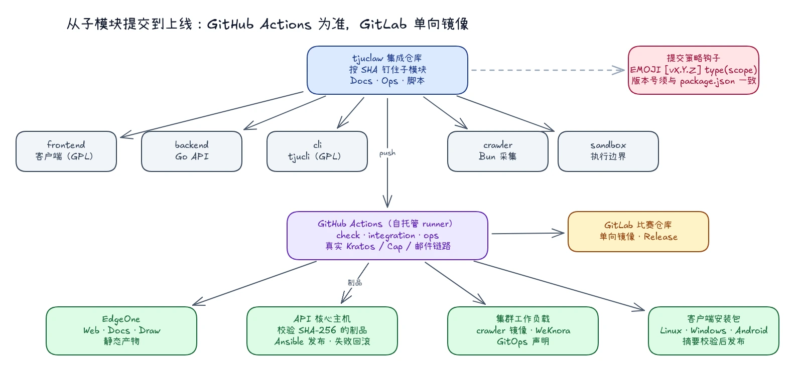

# 从代码仓库到持续交付：TJUClaw 的仓库划分与 CI/CD

TJUClaw 同时包含跨端客户端、Go 业务后端、Bun 采集器、校园 CLI、Kubernetes 沙箱和 Next.js 文档站。项目初期最大的挑战往往不是业务逻辑，而是**工程结构的组织方式与持续交付体系的设计**。

单一巨石仓库会让 pnpm、Go Modules、Bun、Cargo 的依赖互相干扰，也无法同时满足「客户端开源、后端私有」的可见性要求；完全拆散的多仓库，又会让组件之间的版本契约和集成测试难以追溯。

TJUClaw 的做法是：**一个集成仓库做主干，Git 子模块按 SHA 钉住每个组件，GitHub Actions 为权威 CI，GitLab 作为单向镜像。**

---

## 1. 仓库划分与可见性

| 仓库 | 路径 | 可见性 | 技术栈 | 职责 |
| :--- | :--- | :--- | :--- | :--- |
| `tjuclaw` | 根目录 | 公开 | Taskfile、Next.js + Fumadocs、Ansible | 集成中枢、文档与博客、运维、跨组件测试 |
| `tjuclaw-client` | `frontend/` | 公开（GPL） | React 19、Vite 8、Tailwind CSS 4、Tauri v2 | Web、桌面与 Android 客户端 |
| `tjucli` | `cli/` | 公开（GPL） | Go | 公开课程 CLI、知识检索、带授权的工具服务 |
| `tjuclaw-server` | `backend/` | 私有 | Go 标准库 `net/http` | 业务 API、认证网关、Agent 工具循环 |
| `tjuclaw-crawler` | `crawler/` | 私有 | Bun、PostgreSQL | 公开源采集、脱敏、Git 同步、WeKnora 导入 |
| `tjuclaw-sandbox` | `sandbox/` | 私有 | Go、Kubernetes | 会话网关、控制器与执行边界 |

根目录的 Apache-2.0 许可证只覆盖集成仓库本身，不覆盖 GPL 子模块，也不覆盖私有组件。

依赖彼此隔离：根目录与文档站使用 pnpm 工作区；客户端和绘图板各有自己的锁文件；采集器使用 Bun；后端、CLI 与沙箱各有独立的 `go.mod`。没有任何两个子系统争抢同一份全局依赖。

---

## 2. 强版本约束：提交策略钩子

跨子模块开发里，「子模块指针悬空」和「版本号与提交不一致」都是很隐蔽的隐患。根目录的 `scripts/git-policy.mjs` 在提交时强制执行：

- **提交主题格式**：

  ```text
  EMOJI [vMAJOR.MINOR.PATCH] type(scope): summary
  ✨ [v0.0.43] feat(weknora): import extracted attachment text cited to its article
  ```

  并且 emoji 必须与类型匹配：`feat ✨`、`fix 🐛`、`docs 📝`、`refactor ♻️`、`perf ⚡`、`test ✅`、`chore 🔧`、`ci 👷`、`build 🚀`、`revert ⏪`；
- **版本号一致**：主题里的 `[vX.Y.Z]` 必须等于被暂存组件 `package.json` 中的版本；
- **显式暂存**：禁止 `git add .`，每个路径逐一暂存；禁止强制推送。

每个组件先在自己的仓库提交、推送，再由集成仓库提交一次「钉住」子模块指针的 `chore(integration)`。于是集成仓库的任意一个提交，都精确对应着一组可以复现的组件版本。

---

## 3. 持续集成：GitHub Actions 为准



*图：集成仓库的推送触发 CI；通过后，静态产物、API 制品、集群镜像与客户端安装包分别进入各自的发布通道。*

所有工作流运行在项目自托管的 runner 上，统一通过根目录 `Taskfile.yml` 调用，本地与 CI 执行的是同一组命令：

```text
push（release / dev / tag）
  │
  ├─ mirror          轻量 runner。只把选定的 ref 以非强制方式推到 GitLab
  │
  └─ plan            轻量 runner。与上一次成功的运行比较，选出这次改动需要的任务
       │             标签、手动触发、公共构建输入或认不出的路径：全部运行
       │
       ├─ check           检出钉住的子模块；仓库工具检查每次都跑
       │                  Web、Docs、API、CLI、采集器各自只在被改动时检查
       │                  后端 race 只编译一遍；后端有改动才产出带 SHA 的 Linux API 制品
       │
       ├─ ops             部署材料有改动时：playbook 语法检查与回滚模拟
       │
       ├─ sandbox-images  CLI 或沙箱有改动时：构建并冒烟网关与控制器镜像
       │
       └─ integration     客户端、后端或认证材料有改动时：真实 Kratos + Cap + 邮件捕获
                          认证回归并行跑在同一个栈上；会话和密文对象共用下一次栈
```

### 为什么坚持真实的集成测试

在很多项目里，认证只用 Mock 返回一个 200。但真实世界的问题往往出在：Cookie 的 `HttpOnly`/`SameSite` 行为、代理只剥离一次 `/api` 前缀的边界、验证码生成与核销的原子性、人机验证令牌的单次消费。

`task auth:test` 会拉起真实的身份服务、人机验证服务和邮件捕获服务，用无头浏览器完成「输入邮箱 → 收到验证码 → 登录 → 保存数据 → 退出」的完整流程。只有真实交互通过，这一轮 CI 才算通过。

与之配套，工作区的 UI 回归使用隔离的 Mock API（`task workspace:test`），保证界面测试稳定、可重复；这两类测试的边界写得很清楚：**Mock、健康检查或 CI 通过，都不能当作线上部署成功的证明。**

---

## 4. 各自的发布通道

CI 通过之后，不同的产物去往不同的地方：

| 产物 | 通道 |
| --- | --- |
| Web 客户端 | 客户端仓库 `release` 分支推送后，便携检查与浏览器检查通过，发布到 EdgeOne |
| 文档站与绘图板 | 独立工作流构建静态产物（`output: 'export'`），发布到 EdgeOne |
| API | CI 产出带 SHA 的二进制制品；Ansible 在目标主机校验 SHA-256 后原子切换版本目录，健康检查失败自动回滚 |
| 采集器与 WeKnora | 采集器镜像由工作流构建；集群工作负载以 GitOps 声明管理，密钥不进 Git |
| 客户端安装包 | Linux、Windows、Android 在客户端仓库构建；「Publish Client Downloads」工作流核对 release 祖先关系、两条 CI 与全部制品摘要后才发布 |

API 的发布合同值得多说一句：制品路径、SHA-256 与对应的集成提交写在一个被忽略的本地配置里，playbook 先比对摘要，再把二进制放进以提交 SHA 命名的版本目录，最后切换 `current` 链接并重启服务。任何一步失败都会回到上一个版本。

---

## 5. 比赛镜像与两步发版

比赛评审使用 GitLab。GitLab 仓库只是 GitHub 的**单向镜像**，从不反向同步。

正式版本采用两步发布：

```text
第一步：客户端仓库
  针对特定 SHA 构建安装包 → 计算 SHA-256 → 上传并生成 manifest

第二步：集成仓库
  核对集成 CI 与子模块指针 → 下载并复核客户端 manifest
  → 生成附带 SOURCE.json 的各组件源码包
  → 在 GitLab Release 挂载安装包、源码包与 SHA256SUMS.txt
```

评审下载源码包时，解压即可得到所有组件在当时的精确提交；所有安装包都有公开可核对的哈希。

---

## 6. 运维配置与数据隔离

- 主机配置全部由 Ansible playbook 描述；真实的 inventory、制品路径与主机凭据放在不进入版本库的 `ops/local/` 下；
- 服务凭据以 `0600` 权限的环境文件保存在主机上，不出现在源码、日志、文档或构建上下文里；
- 采集器、WeKnora、身份服务与 API 各自使用独立的数据库，从不共享。

---

## 总结

仓库划分、钉住 SHA 的子模块、强制的提交格式、用真实 Kratos 与 Cap 跑的认证回归、各自独立且可以回滚的发布通道，这些规则单看都有点琐碎。

但正是它们让我们敢于一天提交很多次：任何一次上线都能追溯到一组确定的提交，任何一个组件出了问题，也能单独回退，而不必把整个项目一起拉回去。
