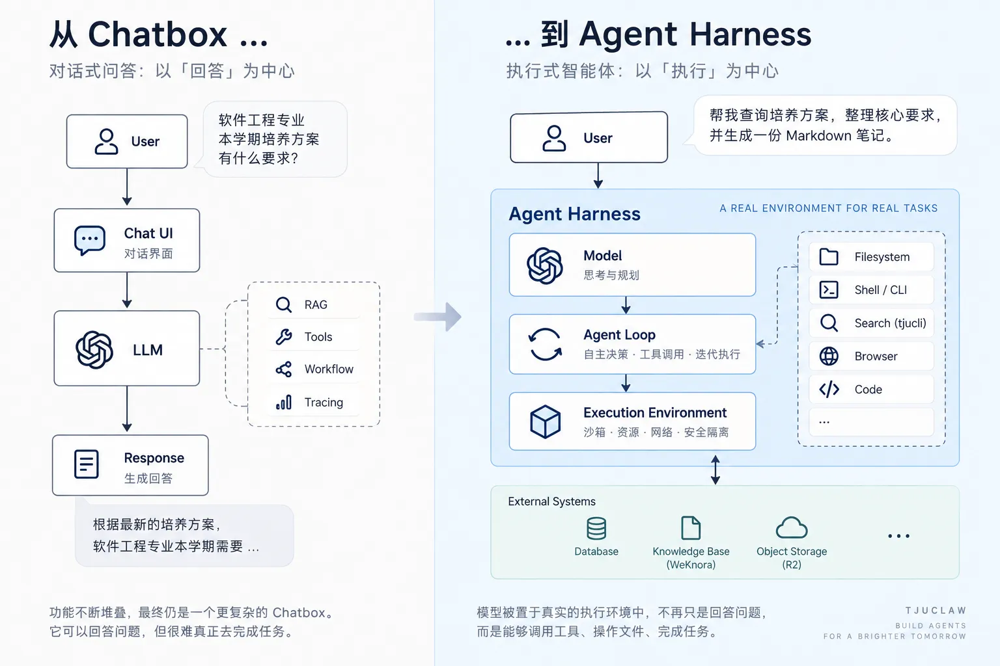

# 《为什么我们选择 Pi 作为 Agent 底座》

在为 TJUClaw 选型 Agent 底座时，我们进行了广泛的方案调研。LangChain 与 LangGraph 无疑是业界最成熟的选项：生态繁荣、集成丰富，且围绕 RAG、Tool Calling、Workflow 与 Tracing 已构建起一套完整的开发范式。

但我们最终并未采用它们。

其原因并非功能上的局限，而是它们所解决的问题域，与 TJUClaw 的核心诉求并不在同一个抽象层级。

---

## 1. 范式之辨：从 Chatbox 到 Agent Harness

下图清晰展示了两种架构在核心哲学、系统拓扑与任务交付模式上的本质演进：



时至今日，大量 Agent 应用的本质依然是在构建一个更为复杂的 **Chatbox（对话界面）**：

- **对话式问答：以「回答」为中心**
  - **典型用户提问**：“软件工程专业本学期培养方案有什么要求？”
  - **系统流向**：`User` $\to$ `Chat UI` $\to$ `LLM` $\to$ 挂载外置的 `RAG`、`Tools`、`Workflow`、`Tracing` $\to$ `Response` 生成回答。
  - **最终产物**：“根据最新的培养方案，软件工程专业本学期需要……”
  - **局限性**：功能不断堆叠，最终仍是一个更复杂的 Chatbox。它虽然能够给出流畅的回答，但很难真正代替用户在受控环境中完成一项端到端的复杂任务。

这一“用户提问 $\to$ 检索上下文 $\to$ 调用工具 $\to$ 返回回答”的模式固然有效，但已不足以支撑下一代 Agent 产品的形态。TJUClaw 的定位从未局限于“校园 AI 助手聊天框”，我们真正致力于构建的是一个 **Agent Harness（智能体执行挂载环境，A Real Environment for Real Tasks）** 作为校园内智能体平台的核心基础设施。

在 Harness 架构下，模型不再是被动等待用户输入的对话引擎，而是被置于一个真实的执行环境中：

- **执行式智能体：以「执行」为中心**
  - **典型用户指令**：“帮我查询培养方案，整理核心要求，并生成一份 Markdown 笔记。”
  - **Harness 核心架构**：
    - **Model（思考与规划）**：负责理解意图、规划分解任务链路；
    - **Agent Loop（自主决策 · 工具调用 · 迭代执行）**：驱动感知与行动的多轮反馈循环；
    - **Execution Environment（沙箱 · 资源 · 网络 · 安全隔离）**：图灵完备的隔离容器环境；
    - **原生接入系统能力**：`Filesystem`（文件系统读写）、`Shell / CLI`（命令行终端）、`Search (tjucli)`（专属校园工具）、`Browser`（受控浏览器模拟）、`Code`（代码编译运行）；
    - **External Systems**：安全对接外部真实存储系统，包括业务关系数据库（Database）、基于 WeKnora 的向量知识库（Knowledge Base）、以及对象存储（Object Storage）。

模型被置于真实的执行环境中，不再只是回答问题，而是能够自主调用工具、操作文件、交付结果、完成任务。

这两者之间不仅是语义的差异，更是底层系统架构的本质区别：

> **Chatbox 的核心是「回答」**
>
> **Harness 的核心是「执行」**

这也是我们放弃从传统“RAG + Chatbot”技术栈出发、逐步堆叠 Agent 能力的原因。这种“打补丁”式的演进极易导致系统变得臃肿：每增加一种新能力，系统就被迫增加一层抽象。

---

## 2. 逆向思考：将高阶能力降维还原为原生基础设施

我们选择逆向思考：首先为 Agent 提供一个图灵完备的沙箱环境，随后将所有高阶能力降维还原为该环境中的原生基础设施：

- **文件操作** $\to$ `filesystem`
- **代码执行** $\to$ `shell`
- **项目与版本控制** $\to$ `git`
- **校园知识与检索** $\to$ `tjucli` 和 `tjucli knowledge search`
- **网络交互** $\to$ CLI / API
- **长期任务** $\to$ Agent Loop + Session 状态管理

对 Agent 而言，它无需感知底层运行的是 WeKnora、PostgreSQL、对象存储还是特定的知识库 SDK。它只需要执行：

```bash
tjucli knowledge search "..."
```

即可获取所需上下文。

---

## 3. 垂直领域的绝对壁垒：校园场景的专属 Harness

这种设计理念，也正是 TJUClaw 与市面上通用 Harness 产品的核心差异。

我们无意重复造轮子去构建一个通用的 Coding Agent——在代码生成、浏览器操控等通用计算机使用能力上，成熟产品已足够优秀。我们的绝对壁垒，在于“校园”这一高度垂直且特定的业务环境。

当一个通用 Agent 收到指令：“软件工程专业本学期培养方案有什么要求？”时，它首先需要跨越巨大的认知鸿沟：理解“软件工程”在特定高校的上下文、寻找可信的数据源、甄别不同年份的文件等。而 TJUClaw 则天生具备为该环境量身定制的工具链与知识基础设施。

我们的目标因此变得明确：**在继承通用 Harness 执行能力的同时，将校园场景的任务处理做到极致的快与准。**

---

## 4. 极致轻量与受控：为什么最终选择 Pi

这一目标对 Agent 底座提出了极为苛刻且特殊的要求。我们不需要一个大而全的框架来替我们重新抽象数据库、知识库、Workflow 或应用层——这些组件 TJUClaw 均已有独立的最佳实践。我们渴求的，仅仅是最核心的执行控制流：

```text
Model
   ↓
Conversation
   ↓
Agent Loop
   ↓
Tool Call
   ↓
Environment
   ↓
Observation
   └────────→ 下一轮
```

这一层必须足够轻量、透明且易于深度定制，同时又必须稳妥地解决掉 Agent 底层的繁杂工程问题：如模型调度、工具循环（Tool Loop）、会话保持、上下文管理、Token 压缩及执行生命周期。

简而言之，我们寻找的并非一个“用于搭建 Agent 应用的重量级框架”，而是一个“能直接嵌入并作为 TJUClaw 内核的 Agent Harness”。

基于这一核心诉求，在广泛评估了大量 Coding Agent、Agent Framework 与 Harness 开源实现后，我们最终选择了 **Pi**。
