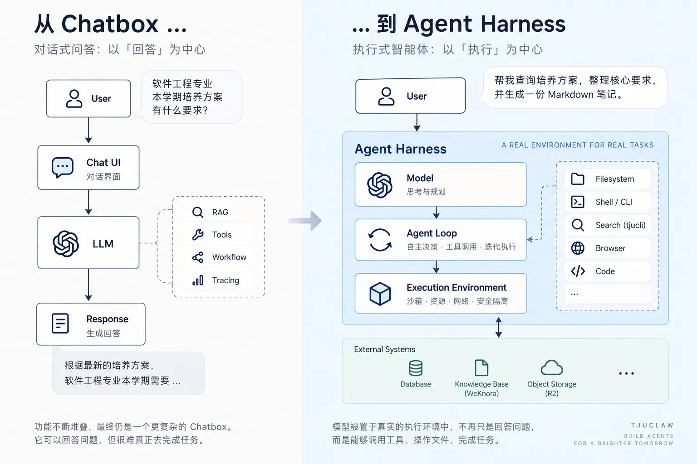
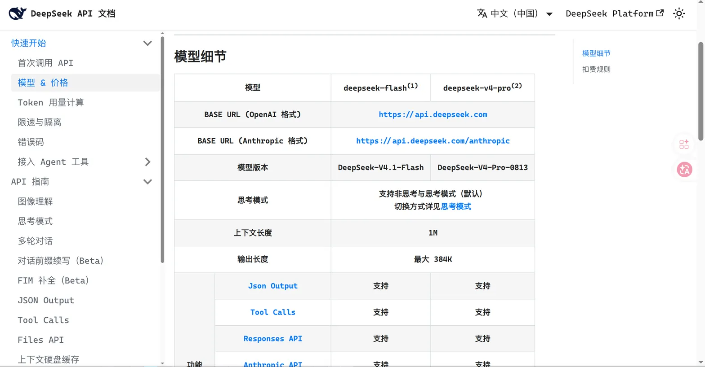

# 为什么我们选择 Pi 作为 Agent 底座

在为 TJUClaw 选型 Agent 底座时，我们进行了广泛的方案调研。LangChain 与 LangGraph 无疑是业界最成熟的选项：生态繁荣、集成丰富，且围绕 RAG、Tool Calling、Workflow 与 Tracing 已构建起一套完整的开发范式。

但我们最终并未采用它们。

其原因并非功能上的局限，而是它们所解决的问题域，与 TJUClaw 的核心诉求并不在同一个抽象层级。

---

## 1. 回答与执行：Chatbox 和 Agent Harness



今天很多 Agent 应用，本质上仍是一个更复杂的 Chatbox。用户问「软件工程专业本学期培养方案有什么要求？」，系统依次经过对话界面、模型、外挂的 RAG 与工具，最后生成一段回答：「根据最新的培养方案，软件工程专业本学期需要……」。

这条「提问 → 检索 → 调用工具 → 回答」的链路很有用，但它的终点是一段文字。功能越加越多，它也只是一个越来越复杂的对话框，很难在一个受控的环境里替用户把一件事从头做完。

Harness 的出发点不同。用户说的是「帮我查培养方案，整理核心要求，写成一篇 Markdown 笔记」，模型被放进一个真实的执行环境里：

- **模型**负责理解意图、拆解步骤；
- **Agent 循环**驱动「调用工具 → 观察结果 → 决定下一步」的多轮反馈；
- **执行环境**是一个隔离的沙箱，有文件系统、Shell、代码运行能力，以及 `tjucli` 这样的校园专用工具；
- **外部系统**包括业务数据库、基于 WeKnora 的知识库和对象存储，通过受控的接口访问。

两者的区别可以用一句话概括：

> **Chatbox 的核心是「回答」，Harness 的核心是「执行」。**

这也是我们没有从「RAG + Chatbot」出发、再一层层往上加 Agent 能力的原因。那条路每多一种能力，就多一层抽象，系统会越来越难以理解。

---

## 2. 反过来：把能力还原成环境里的普通工具

我们反过来设计：先给 Agent 一个完整的执行环境，再把高层能力还原成这个环境里的普通工具：

| 能力 | 在沙箱里的形态 |
| --- | --- |
| 文件操作 | 文件系统 |
| 代码执行 | Shell |
| 项目与版本 | Git |
| 校园资料与检索 | `tjucli`、`tjucli knowledge search` |
| 网络交互 | CLI / API，按授权放行 |
| 长期任务 | Agent 循环 + 会话状态 |

这样一来，Agent 不需要知道背后是 WeKnora、PostgreSQL 还是对象存储，它只需要执行：

```bash
tjucli knowledge search "..."
```

需要说明的是，这是会话沙箱的设计目标。云端沙箱目前已经实现、但还没有切换到生产；线上的 Agent 通过 Go API 内置的工具循环使用同一批能力，具体分工见第 5 节。

---

## 3. 我们的优势在校园，而不是通用能力

这也是 TJUClaw 和通用 Harness 产品的区别所在。

我们不打算再造一个通用的 Coding Agent：写代码、操作浏览器这些通用能力，成熟的产品已经做得很好。TJUClaw 能做得更好的，是「校园」这个具体的环境。

同样问「软件工程专业本学期培养方案有什么要求？」，通用 Agent 首先要弄清「软件工程」在这所学校指什么、去哪里找可信的来源、怎么分辨不同年份的文件。TJUClaw 从一开始就有为这个环境准备的工具链和知识库。

所以我们的目标很明确：**保留通用 Harness 的执行能力，同时把校园场景的任务做得又快又准。**

---

## 4. 需要的只是执行控制流：为什么是 Pi

这个目标决定了我们对 Agent 底座的要求。数据库、知识库、工作流和应用层，TJUClaw 都已经有各自独立的实现，我们不需要一个大而全的框架把它们重新抽象一遍。我们需要的只是最核心的执行控制流：

```text
Model
   ↓
Conversation
   ↓
Agent Loop
   ↓
Tool Call
   ↓
Environment
   ↓
Observation
   └────────→ 下一轮
```

这一层要足够轻、足够透明、容易深度定制，同时又要替我们处理好 Agent 底层那些繁琐的工程问题：模型调度、工具循环、会话保持、上下文管理、Token 压缩，以及执行的生命周期。

换句话说，我们要找的不是「用来搭建 Agent 应用的框架」，而是一个「能直接嵌进 TJUClaw、作为内核的 Agent Harness」。按这个标准比较了几类 Coding Agent、Agent 框架和开源 Harness 之后，我们选择了 **Pi**。

---

## 5. Pi 在 TJUClaw 里的位置

Pi 运行在沙箱里，而不是 API 进程里。原因很直接：Harness 需要真实的 Shell 与文件系统，而这两样东西只应该出现在一个凭据不入、网络默认拒绝的隔离环境中。

目前的分工是：

- **线上会话**：Go API 内置一个有界的工具循环（最多 8 轮、150 秒上限），提供校园工具、公开知识检索与看图。它没有 Shell，但已经能完成「查考试安排」「找往年资料」「读懂一张通知截图」这类校园任务；
- **会话沙箱**：每个会话一个隔离 Pod，Pi 在 `/workspace/repo`（用户的 Forgejo 仓库）中工作，每一步 commit 并 push；模型与 Git 凭据由 Broker 持有，不进入沙箱。这一路径已经实现，生产切换安排在比赛截止之后。

两条路径使用同一套工具约定：输入有界、输出结构确定、错误是稳定的机器码。所以当会话切换到沙箱时，Agent 学到的「怎么用工具」不需要重来。

---

## 6. 为什么主模型选择 DeepSeek

Pi 负责 Agent 的执行控制流，但它不决定模型如何理解目标、规划步骤、选择工具，以及如何根据工具输出修正下一步。对 TJUClaw 来说，主模型必须服务于一个真实的执行循环，而不只是生成一段流畅的回答。

默认产品模型是 DeepSeek-V4.1-Flash，在界面上显示为「蓝色大肥鱼」。它同时提供思考与非思考模式、1M 上下文、JSON 输出和 Tool Calls，通过 OpenAI 兼容 API 接入；它还是原生多模态模型，可以直接读取 JPEG、PNG、GIF、WebP 图片，因此 `read_image` 工具不需要另配一个视觉模型。用户也可以在设置里切换到另一个产品模型「太阳」，或者填写自己的 OpenAI 兼容 API。



*图：DeepSeek API 文档中的模型细节表。*

一个实际踩过的坑：推理模型会先消耗一部分输出预算用于思考。早期给看图请求设置的 `max_tokens` 过小，模型把预算全部花在了思考上，返回空内容，我们一度误以为它不支持图片。现在看图请求预留 2000 个 token，响应稳定在几秒之内。

主模型的选择标准不是单轮问答排行榜，而是执行任务时的综合表现：

1. 能否稳定生成工具调用及其参数；
2. 能否在多轮 Observation 后修正计划，而不是继续猜测；
3. 能否处理中文校园语境、文件内容和代码/命令结果；
4. 能否在较长上下文中保持任务目标、权限边界和来源信息；
5. 能否通过标准 API 稳定接入，并在失败时返回可记录、可重试的错误。

因此，DeepSeek 是 TJUClaw 的**主执行模型**，但不是所有阶段的唯一模型：

```text
DeepSeek-V4.1-Flash（蓝色大肥鱼）
    → Agent 的规划、工具调用、看图与最终回答

PaddleOCR-VL v1.6
    → 扫描 PDF、图片与课件的版面与文字识别

校园大模型 tju-llm-max
    → OCR 结果的结构修复，以及知识库的文档摘要

Qwen3.7-text-embedding / 1024 维
    → WeKnora 向量索引
```

这是一种职责分离，而不是模型堆叠：主模型关注行动与交付，OCR 关注看清原件，校园大模型关注整理与摘要，向量模型关注语义表示。这样更容易分别评估每个环节，也避免为了检索或 OCR 更换模型时影响 Agent 的执行行为。重排序模型已完成选型，但生产知识库目前尚未启用。

模型的具体快照、网关路由和评测结果需要随部署记录保存。模型升级后，应重新检查工具调用正确率、任务完成率、P95 延迟和单任务成本，不能仅因为模型名称相同就假设行为完全不变。
