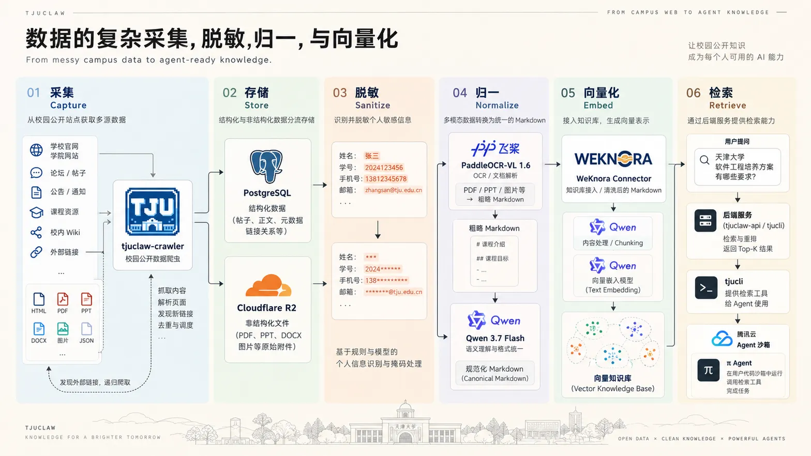

# 介绍 TJUClaw

TJUClaw 是面向天津大学校园场景优化的智能体（AI Agent）平台。平台围绕校园学习与日常事务场景设计，通过将校园公开信息与高频服务抽象为确定性工具接口，配合隔离执行环境，帮助学生完成课程资料检索、空闲教室查询等任务并交付可校验的结果。

---

## 快速开始

可以通过以下方式直接体验平台功能：

- **Web 端**：访问 [https://tjuclaw.cloud/](https://tjuclaw.cloud/)，直接使用工作台创建和管理任务；
- **原生客户端**：可在首页获取对应平台的安装包：
  - **Windows**: 64 位安装程序（`.exe`）
  - **Linux**: Debian / Ubuntu 软件包（`.deb`）
  - **Android**: 安装包（`.apk`）

> 本地源码调试与完整开发环境搭建步骤，请参考：[快速开始指南 (Quickstart)](https://tjuclaw.cloud/docs/quickstart)。

---

## 模块划分与仓库矩阵

> **主要仓库说明**：TJUClaw 的主要开发仓库公开可访问。全平台自动化构建、跨端编译矩阵（Linux / Windows / Android）以及多项集成测试由持续集成流水线完成。如需检出最新完整源码、追踪流水线状态或提交 Issue / PR，请通过下表仓库地址访问。

| 仓库 / 模块 | 访问级别 | 仓库地址 | 技术栈 | 职责与说明 | 本地路径 |
| :--- | :--- | :--- | :--- | :--- | :--- |
| **tjuclaw** | 开源 | [yunzaixi-dev/tjuclaw](https://github.com/yunzaixi-dev/tjuclaw) | TypeScript · Next.js 16.3 · Fumadocs | **总集成仓与文档** 包含 Taskfile 统一指令、文档站与 Ansible 部署配置 | 根目录 (`.`) |
| **tjuclaw-client** | 开源 | [yunzaixi-dev/tjuclaw-client](https://github.com/yunzaixi-dev/tjuclaw-client) | TypeScript · React 19 · Tauri v2 | **多端客户端** 构建 Web 端及 Windows、Linux、Android 客户端 | `frontend/` |
| **tjuclaw-server** | 开源 | [yunzaixi-dev/tjuclaw-server](https://github.com/yunzaixi-dev/tjuclaw-server) | Go 1.27 | **业务 API 与会话网关** 处理业务逻辑、任务状态管理与认证鉴权 | `backend/` |
| **tjucli** | 开源 | [yunzaixi-dev/tjucli](https://github.com/yunzaixi-dev/tjucli) | Go 1.27 | **命令行工具与 Tool Server** 将校园公开服务封装为标准输入输出的 CLI 工具 | `cli/` |
| **tjuclaw-crawler** | 闭源 | [yunzaixi-dev/tjuclaw-crawler](https://github.com/yunzaixi-dev/tjuclaw-crawler) | TypeScript · Bun · PostgreSQL | **公开情报采集** 采集校园公开信息，生成增量事件流与结构化数据 | `crawler/` |
---

## 核心架构设计

系统设计遵循职责隔离与可验证原则，主要体现在以下几个维度：

### 1. 跨平台客户端
基于同一套前端组件与状态逻辑构建 Web 与各桌面/移动平台客户端，保持交互与视觉一致，支持在 PC 端创建任务并在移动端查看进度。

### 2. 存算分离
任务执行环境与数据存储分离。智能体操作在无状态的临时沙箱中运行，任务元数据、文件与长期记忆由独立的存储系统（PostgreSQL、对象存储 COS 等）承接。

### 3. 沙箱隔离与执行安全
对于涉及文件下载与脚本运行的流程，调度隔离沙箱执行；敏感认证信息统一使用同源 HttpOnly Cookie 管理，凭据不暴露给大模型上下文。

### 4. 记忆与检索
区分当前任务上下文的工作记忆与长期偏好记忆；结合自托管知识检索引擎 WeKnora，实现文档知识的检索与召回。

### 5. 确定性工具接口
将校园公开服务封装为强类型的独立命令行工具 `tjucli`，输出标准 JSON，通过命令执行状态码和文件哈希（SHA-256）验证执行结果。

### 6. 云边协同部署
静态站点部署于 EdgeOne 边缘网络，动态 API 请求通过网关反向代理至后端服务容器，多平台客户端通过自动化流水线完成构建与测试。

---

## 技术博客与深度专题 (Engineering Blog)

TJUClaw 涵盖了客户端跨端、网关会话、沙箱调度、知识检索与数据抓取等多项技术栈。为了探讨系统演进与核心工程细节，我们开启了技术博客专栏：

1. [《数据的复杂采集、脱敏、归一与向量化》](./blog/data-pipeline.md)：以线上学院站与课程网盘的真实体量为上游，说明从公开 HTML/PDF 到 Canonical Markdown、WeKnora、文档溯源与 Agent 检索的目标管道。
2. [《为什么我们选择 Pi 作为 Agent 底座》](./blog/why-pi-as-agent-harness.md)：从 Chatbox 与 Harness 的范式之辨出发，探讨我们为何放弃 LangChain/LangGraph 而选择轻量图灵完备的 Pi 作为核心执行环境。
3. [《祖传前后端架构，但是 2026》](./blog/backend-architecture.md)：在微服务与重型框架泛滥的 2026 年，反思后端服务的真实职责——深度解析基于 Go 标准库、HttpOnly 强同源防线与存储插拔的服务端架构设计。
4. [《智能体的代码执行、文件系统，与隔离沙箱》](./blog/code-execution-and-sandbox.md)：深入解析 TJUClaw 在 Go 业务 API 网关、腾讯云微隔离执行沙箱与 Agent 运行时架构中的核心设计与工程落地。
5. [《为什么我们把 Agent 的能力做成 CLI：tjucli 的设计》](./blog/why-cli-as-agent-tool.md)：反思复杂 MCP 与臃肿 RPC 框架的过度封装，深度解析为什么我们将智能体的所有校园能力收敛为 Unix 哲学标准的确定性 CLI。
6. [《跨平台智能体客户端的实现：Web、桌面端与移动端》](./blog/cross-platform-clients.md)：一套代码全端运行——深入剖析基于 React 19、Tailwind CSS 4 与 Tauri v2 的多端客户端架构设计、OKLCH 视觉系统与安全会话流。
7. [《从代码仓库到持续交付：TJUClaw 的仓库划分与 CI/CD》](./blog/repository-and-cicd.md)：多技术栈异构、公私仓库混合、跨平台四端构建与比赛合规镜像——深入剖析 TJUClaw 从 Git 子模块拓扑到持续集成流水线的交付实践。
