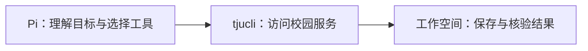

<div class="cover">
<h1><span>面向天津大学校园场景优化的</span><span>通用智能体平台</span></h1>
<p class="lead">参赛选手：TJUClaw 项目团队</p>
</div>

<!--
开场用一个具体目标介绍产品，而不是先罗列技术。
这是一份随实现更新的演示草稿。现场展示前必须重新核对第九页状态。
-->

---

# 从学生的一句话开始

<div class="request">“帮我找到这门课的复习资料，<br>保存到我的工作空间。”</div>

<div class="columns three">
<section><h2>找到入口</h2><p>确定课程与资料来源，避免在多个页面之间反复寻找。</p></section>
<section><h2>选对文件</h2><p>查看目录和文件信息，确认资料是否符合这次需求。</p></section>
<section><h2>留下结果</h2><p>下载、核验，并告诉用户文件在哪里、来自哪里。</p></section>
</div>

<!--
这是产品要解决的任务，不是已经完成的用户案例。
避免对其他产品作未经验证的“都不能做到”之类的比较。
-->

---

# 目标链路：理解、调用、交付

<p class="subtitle">从目标理解到结果交付的完整链路</p>



<div class="callout">完成的依据是实际结果：文件存在、来源明确、操作状态可解释。</div>

<!--
目前已验证公开课程平台的目录和小文件下载接口。
Pi 到产品工作空间的完整自动执行链路仍需实现与端到端测试。
-->

---

# tjucli：统一校园能力入口

| 能力组 | 产品能力 | 使用范围 |
| --- | --- | --- |
| 课程资料 | 课程名检索、目录浏览、选定文件下载 | CLI 与公开接口已实测 |
| 公开校园信息 | 空教室、校园知识、图书目录等 | 逐项核实接口与覆盖范围 |
| 个人校园信息 | 课表、考试、成绩、借阅记录等 | 需要单独核实学生授权协议 |
| 校园写操作 | 有证据支持的发布、回复等操作 | 接口与用户确认机制待设计 |

<p class="footnote">能力覆盖围绕天津大学校园场景持续扩展，平台会对每项结果给出来源、状态与交付位置。</p>

<!--
不要把微北洋的产品功能列表等同于已稳定开放的 API。
Kratos 的产品登录也不等于用户已经授权访问个人教务信息。
-->

---

# Pi、Skill、CLI 各自负责什么

<div class="roles">
<section><h2>Pi</h2><p>理解目标、选择下一步，并根据真实返回结果调整计划。</p></section>
<section><h2>Skill</h2><p>说明命令语法、参数、错误处理与结果核验方法。</p></section>
<section><h2>tjucli</h2><p>执行已支持的请求，输出结构化结果和明确的退出状态。</p></section>
</div>

<div class="callout">Skill 是操作说明，不是沙箱。文件、网络与身份权限需要执行环境和后端分别落实。</div>

<!--
Pi SDK 通过产品 Skill 连接校园工具，让智能体可以按任务选择合适的服务入口。
不要声称启用 bash 后模型只能执行 tjucli，也不要承诺绝对不会发生泄漏。
-->

---

# 已验证的一个小步骤

<p class="subtitle">CLI 实测：目录分页、课程名检索与小文件下载；Pi 自动任务仍待接入</p>

<div class="columns two">
<section>
<h2>目录与分页</h2>
<p>目录分两页返回：100 条与 21 条。CLI 课程名检索扫描两页，返回完整性标记。</p>
<p>搜索接口当次返回 HTTP 500，因此首版 CLI 采用分页目录匹配课程名称。</p>
</section>
<section>
<h2>真实小文件下载</h2>
<p>选定课程目录中的 README 经 HTTPS 重定向下载成功。</p>
<p><strong>180 字节</strong> · HTTP 200</p>
<p class="hash">SHA-256 前 16 位：f5f1b8e5da4ea1d20</p>
</section>
</div>

<p class="footnote">来源：<a href="https://cs.tjuse.com">cs.tjuse.com</a>。这次检查不代表全部目录或资源持续可用。</p>

<!--
实测文件：/2020701_电路信号与系统/README.md。
完整 SHA-256：f5f1b8e5da4ea1d20796632ed3f5e983be5cb1dc6dd42823c0945f48b2e99d2e。
检查日期：2026-09-08。现场演示前重新验证，不把历史接口检查说成现场 CLI 成功。
-->

---

# 首批 CLI 命令

<p class="subtitle">已完成实际调用，构建版本与仓库版本一致</p>

```bash
tjucli capabilities --json
tjucli course search "电路信号与系统" --json
tjucli course ls "/2020701_电路信号与系统" --json
tjucli course download "/2020701_电路信号与系统/README.md" \
  --output "./course-readme.md" --json
```

<p>先发现能力，再选定目录和文件。检查分页范围、退出状态和落盘结果。</p>

<!--
这里不编造 CLI 输出；列出的命令已实测，可在正式汇报时配合真实终端演示。
示例 README 只用于快速连通性演示，不代表完整复习资料。
-->

---

# 每一层都需要明确边界

| 层次 | 约束 | 验证方式 |
| --- | --- | --- |
| 产品身份 | Kratos 会话；浏览器同源请求 | 真实邮箱与 Cookie 回归 |
| 任务归属 | 后端从会话确定用户 | 跨用户读取与重启持久化测试 |
| 校园授权 | 产品账号与校园授权分开处理 | 对每个个人信息接口单独验证 |
| 文件下载 | 不覆盖已有文件；限制大小 | 失败清理、大小与校验和测试 |
| Agent 执行 | 每用户目录及受控执行环境 | 运行时隔离与越权测试，待接入 |

<!--
本页列验收要求，不能把“需要满足”改讲成“全部满足”。
任务归属与 CLI 的本地测试已通过，产品执行环境负责承接任务并保存结果。
-->

---

# 当前进度，以验证结果为准

| 模块 | 已有证据 | 仍需完成 |
| --- | --- | --- |
| 认证与外观 | 真实邮箱与外观回归通过 | 原生端认证与校园授权接入 |
| 任务工作区 | 保存、刷新及跨用户隔离实测通过 | 执行引擎接入、任务结果展示 |
| tjucli | CLI 列表、课程名检索与下载实测 | 其他校园能力覆盖、Pi 调用接入 |
| Pi / Skill | 加载方式核对、Skill 草稿 | 实际调用与完整任务执行 |
| CI/CD | GitHub 独立 CI 与三平台打包通过 | 比赛发布、真机与生产验收 |

<!--
每次正式演示前更新本页，附上经过审核的截图、命令输出或制品。
不要把本地构建、YAML 校验或启动脚本当成生产部署的证据。
-->

---

# 最终演示，要交出一个真实结果

<div class="request">一门课，一份选定的资料，<br>一个能打开的工作空间文件。</div>

<div class="columns two">
<section><h2>成功时</h2><p>展示来源、文件路径、大小与校验信息，让用户能够打开和继续使用。</p></section>
<section><h2>失败时</h2><p>说明失败原因和当前状态，保留用户目标，不把半成品显示为完成。</p></section>
</div>

<p class="closing">TJUClaw · 认真跑通每一步，交出经得起核验的真实结果</p>

<!--
实际链路接通后，从这一页切到现场演示。
提前准备经过核验的备用录屏；尚无录屏时不要声称存在备用证据。
-->

---

# 致谢

<p class="thanks-lead">TJUClaw 这个项目，其实是我一个人做出来的。</p>

<p>特别感谢天外天工作室已经毕业的学长们，还有之前开发微北洋时积累的工程经验，以及踩过的那些坑。</p>

<p>要是没有那段经历，面对这么复杂的项目，我一个人可能根本没底气做下来。放以前，要在几天里做这么多东西，我一个人很难做到。</p>

<p>但这次有 AI 陪着我，一起拆问题、查资料、写代码、跑测试，短短几天能推进到现在，对我来说真的像一场奇迹。</p>

<p>虽然云端还有一些细节没完全收尾，不过剩下的部分，我会继续把它做好。</p>

<p class="closing">TJUClaw · 一个人开始，把复杂的事情一步步做成真实结果</p>
